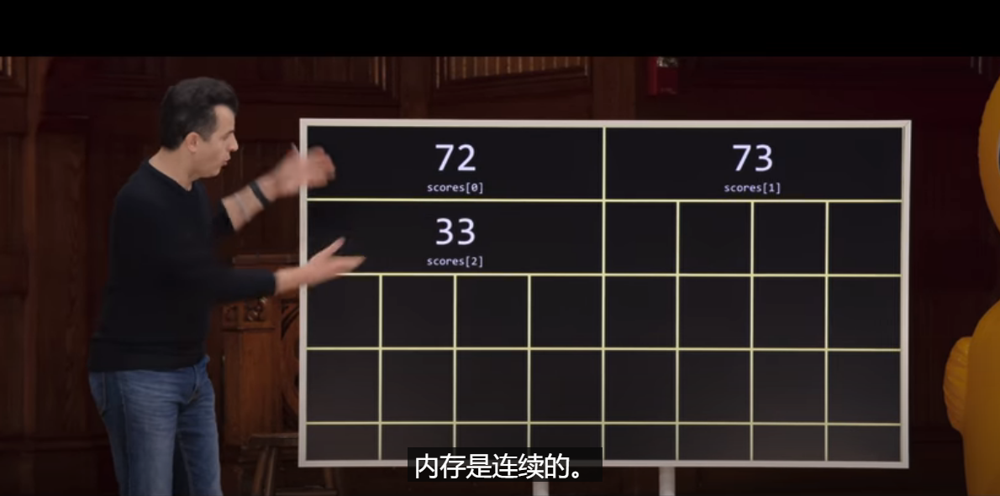
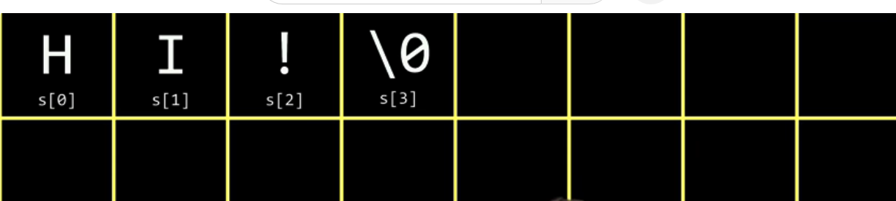
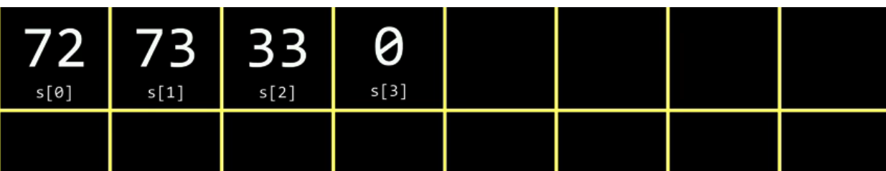

# 编译器

* 编译器的工作是将代码转换成二级制文件,以便让电脑可以识别并运行

* 有很多种类的编译器

  * gcc	---古老的编译器
  * clang  ---现如今最流行的编译器

   


```c
clang -o hello hello.c -lcs50
//使用clang编译hello.c设置编译文件名为hello,并链接cs50的库
```

* 对于我们使用的`make`这是一个自动化编译的命令,但是有的时候**错误并不来自于make**,而来自于更底层的**clang**,所以更建议使用更底层的代码以保证找到bug的原因


____

# 哈希`#`

```c
#include <cs50.h>
#include <stido.h>
```

发生了什么?

1. 在你的硬盘上(Linux为例)(/usr/include)中含有这些库文件
2. 查找这些文件,寻找你使用的方法
3. 编译


___

# 反编译

程序可以编译,当然也可以反编译

*尽管耗时耗力*


___

# 使用调试器

如果想要使用vs code的调试器,需要许多复杂的步骤


但是有其他更简单的方法:设置断点

```c
设置运行断点
    在代码行前设置断点
make <filename>;
debug <filename>;    
```


在vscode的左侧会打开一个窗口,可以看到许多变量名称:

* 局部变量
* 全局变量


# 数组




# string

```c
string c = "myname";
```

字符串可以看成一串数组





* 因为acsll码
* 一般来说,数组没有"\0"作为结尾,唯独字符串有

```c
int mian(void){
    string s = "hi!";
    printf("%c%c%c\n",s[0],s[1],s[2]);
}
//输出hi!

example:

int main(void){
    string worlds[2];
    worlds[0] = "hi!";
    worlds[1] = "bye!";
    printf("%c%c%c\n",worlds[0][0],worlds[0][1],worlds[0][2]);
     printf("%c%c%c\n",worlds[1][0],worlds[1][1],worlds[1][2]);
}
//输出
hi!
bye!

```

注意 : " "表示字符串 ' '表示ASCLL码

___

#使用 int main(int argc,string argv[])

```c
#include <cs50.h>
#include <stdio.h>

int main(int argc,string argv[]){
    printf("hello, %s\n",argv[1]);
}

//输入 ./greet David
//输出 hello,David

int main(int argc,string argv[]){
    printf("hello, %s\n",argv[0]);
}

//输入 ./greet David
//输出 hello,./greet

```


# 退出状态


