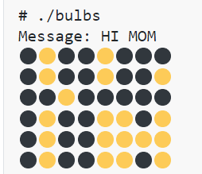
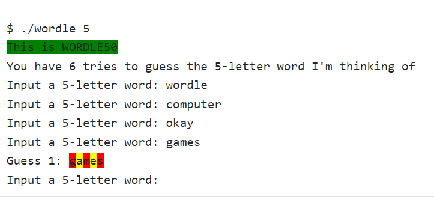

# scrabble

* 此programme让我们编写了一个小游戏,用户需要输入一段单词,每个单词的每个字母都有自己的权值,将这些权值加起来得到points,以判断谁赢

## 设计思路

设置一个**计算**方法,然后再`mian`函数中使用if进行比较

* 设置一个数组,其中该数组的编号就是这些字母的权值
* 使用switch语句进行判断,累加权值
* *可以选择合适的数组,使其空间利用率较高*


details:

* 我们需要判断**大小写**
* 需要判断用户输入的意料之外的字母,如(`!`,`,`,`.`等)


# bulbs

* 此programme让我们编写一个展示单词的脚本,如下图



规则:我们知道字母在计算机中是按照ASCLL码存贮的,我们可以使其直观的表现出来,图片中的每一行代表一个字母,其中**黄色**代表**1**,**黑色**代表**0**


## 设计思路

* 也正是因为字母在计算机中储存的是ASCLL码,我们可以直接将计算机内容中的**位**表示出来
* 涉及到字符转换
* 设计`print_bulb`函数,专门输出图形
* 设计`returnBinary`位返回的二进制数


下面将对部分代码进行分析

```c
输出二进制函数的代码
void returnBinary(char string){
    for(int i = 7; i >= 0  ; i--){
         if(string & ( 1 << i )){		//按位与
            print_bulb(1);
         }else
            print_bulb(0);
    }
    printf("\n");
}

# 1 << i #
如果 i = 1 //输出 10
    i = 2 //输出100
假设字符为 a( 01100001)
1. i = 7 //输出1000,000
    按位与0000,0000  //最后输出0
2. i = 6 //输出100,000
    按位与0000,0000  //最后输出1
3. i = 7 //输出10,000
    按位与0000,0000  //最后输出1
于此类推...
```


# wordle

* 此programme让我们设计一个猜单词游戏,以每个字母为单位,如果这个字母在正确的位置,则输出绿色,如果这个单词中有这个字母但不在正确的位置,输出黄色,如果完全没有这个字母,输出红色



## 设计思路

* 该项目设计了 7 个问题让我们分别求解
* 我们可以分别猜5,6,7个字母的单词
* 设计3个方法,一个负责捕获用户输入,一个负责检查单词,一个负责输出单词


```c
wordsize = argv[1][0] -'0'; //将用户输入的设置单词长度的字符串更改为int类型的整数

注意,由argv获得的数组,argv[0]为程序名本身,此后才为输入的其他命令

当你使用字符串时,argv[1]代表字符串本身
    			**只有使用argv[1][0]**才是字符串中的单个单词(char)
```


