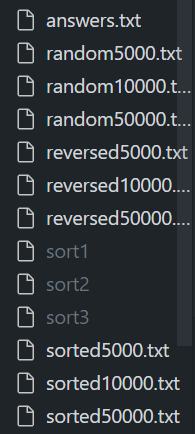

# Project 1

实验一给了我们3个算法文件,我们不能查看其中的具体内容,只能通过运行判断

这三个算法分别是: 冒泡排序, 选择交换, 二路归并


同时分别给了我们倒序的,顺序的,随机的 数字文件,包括5000滋,10000字,50000字




只需要运行reversed50000来判断就够了

## 思路


sort1 uses: bubble sort

How do you know?: 排序reversed50000,使用时间最长,因为进行多次数值互换

sort2 uses: merge sort

How do you know?: 排序reversed50000,使用时间最短

sort3 uses:selection sort

How do you know?:排序reversed50000,使用时间第二,因为只进行一次数值互换


# Project2

这个实验要求我们使用算法推举候选人

```c
candidate_count = argc - 1; //从命令行中读取选举人信息
```


## 思路

同用户输入使用`for`判断是否在candidates数组中,如果在,返回true并`candidates[i].votes++`,如果不在返回false

在`print_winner`函数中,如果选举人票数相同,则全都输出

我的想法是,声明一个winner来储存winner,如果找到了相同票数的人,就使用

`strcat`将该候选人加到winner后

* 如果没有票数相同的,则不运行`stract`
* 如果票数相同且票数最大,使用malloc创造空间容纳另一个候选人
* 如果票数相同,但不是最大的,那么通过循环自然可以将候选人刷新掉


```c
 char* winner = (char*)malloc(strlen(candidates[0].name)+1);
    strcpy(winner, candidates[0].name);
    int winner_count = candidates[0].votes;
    for(int i = 1; i < candidate_count; i++){
        if(candidates[i].votes > winner_count){
            winner_count = candidates[i].votes;
            strcpy(winner, candidates[i].name);
        }else if(candidates[i].votes == winner_count){
            int length = strlen(winner) + strlen(candidates[i].name) + 2;   //声明要加入的候选人的空间并加2,一个用来答应换行符,一个用来加入'\0'尾缀
            char* resultString = (char*)malloc(length);
            strcpy(resultString , winner);
            strcat(resultString , "\n");
            strcat(resultString , candidates[i].name);
            free(winner);			//需要释放之前的创造的winner,否则会内存溢出
            winner = resultString;		//将resultSting的地址赋给winner
        }
}

    }

    printf("%s\n",winner);
    free(winner);					//最后我们要把winner释放,否则会内存溢出
    return;
```

但是我的代码肉眼可见的乱


# Project3(tideman)

tideman算是plurality的变种,加强版

文档首先定义了一大堆的内容,需要我们判断依据投票数来定义每对候选人的winner和loser,再根据这个数组 对候选人进行排序,由winner指向loser


**组成一个没有回环的树**,在通过这个树来判断谁才是真正的赢家


这个lab需要我们写7个函数,以导入数组,排序,生成树,打印winner等操作,我只调印象深刻的部分写了

* add_pairs(void)

```c
void add_pairs(void)
{
    // TODO
    for(int i = 0; i < candidate_count; i++){\
        for(int j = i; j < candidate_count; j++){   //如果j = 0,那么会重复赋值,因为我是将它当成对称矩阵看的
            if( preferences[i][j] > preferences[j][i] ){
                pairs[pair_count].winner = i;
                pairs[pair_count].loser = j;
            }else if( preferences[i][j] < preferences[j][i] ){
                pairs[pair_count].winner = j;
                pairs[pair_count].loser = i;
            }else{
                continue;   //候选人本身不能和自己进行比较
            }
            pair_count++;
        }
    }
    return;
}
```

* sort_pairs

这个函数根据候选人选票数量对候选人对进行排序

```c
void sort_pairs(void)
{
    // TODO
    for(int i = 0; i < pair_count - 1; i++){
        for (int j = 0; j < pair_count - i - 1; j++) {
            int strength1 = preferences[pairs[j].winner][pairs[j].loser];
            int strength2 = preferences[pairs[j + 1].winner][pairs[j + 1].loser];

            if (strength1 < strength2) {
                // Swap the pairs if the current pair has less strength
                pair temp = pairs[j];
                pairs[j] = pairs[j + 1];
                pairs[j + 1] = temp; //注意数组交换时,哪怕是自己定义的数组也能通过三步法进行交换,而不需要将数组内的内容逐个交换
            }
        }
    }
    return;

}
```


* bool checked(int loser,int winner)

这个函数用来检查是否有回环,如果有就返回false,这对候选人将排除在 树 外

```c
bool checked(int loser,int winner){
    for(int i = 0; i < pair_count; i++){
        if(locked[loser][i]){
            if(i == winner){
                return false;
            }
            if (!checked(i, winner)){  //使用递归来判断受否有环,原理是将第一个函数的loser看成第二个函数的winner来判断是否有后继,如果第一个函数的winner通过迭代会指向自己,那么就然会false
             	return false;
            }
        }
    }
    return true;
}
```

* print_winner()

这个函数就不贴代码了,我最开始想的是可以通过 类似Checked的方法来检查是否有前驱,但是只要通过检查定义的 储存有向图 的数组,是否winner有前驱,即可判断winner,因为程序假设没有票数相同的人
