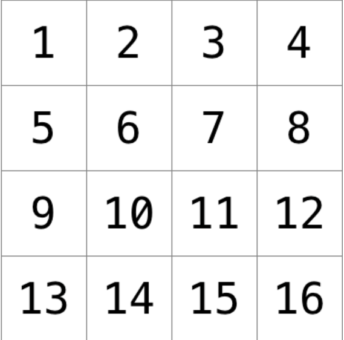
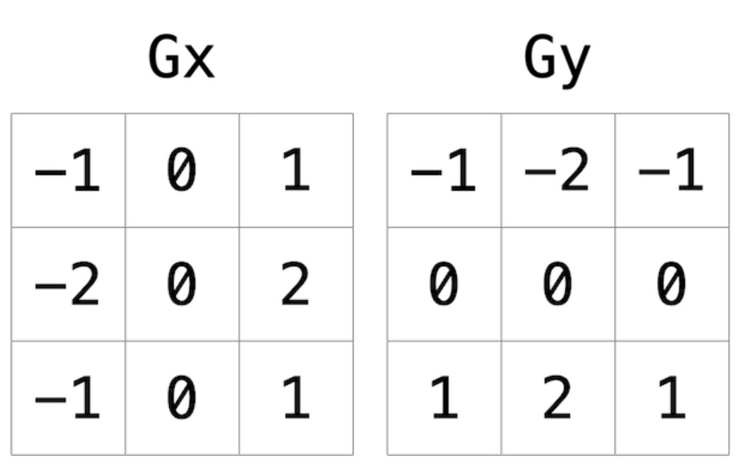

# Project1

提供给我们一部分的音频文件,要求我们放大声音

* wav文件由 44个字节的首部和发音部分组成
  * 首部展示了文件大小,每个音的格式等信息
  * 发音部分 每部分由2字节组成 想要放大声音只需要数字放大发音部分即可


## 细节

1. 如何定位文件?

```c
fseek(file, num, <###>);
//num表示偏移量
```

\###中可以使用三个定位符

* SEEK_SET	:文件开始
* SEEK_CUR   :文件当前位置  
* SEEK_END   :文件末尾

2. 如何读取文件?

```c
fread( *ptr, sizeof(), num, input)
//读取每段sizeof(),读取num个,文件input,放到*ptr
```

写文件同理,返回值都为成功写/读的数量

3. 一直让我头疼的是我的代码始终不能通过测试

但是gpt的就可以,而且我的代码和gpt的基本一致,后面实在想不出问题,就索性不弄了


# Project2

我们需要使用三种算法:

* 灰度算法
* 翻转算法
* 边缘算法
* 模糊算发

来处理wav图片,读取图片和写入图片已经为我们写好了,我们只需要写这三个函数即可


## 细节

1. 灰度算法

算法的核心思想是设置红绿蓝的平均值并回代,得到灰度值

注意:

* 由于图片的数据类型大小是 2字节,所以会出现溢出的情况,注意溢出

2. 翻转算法

* 这个不用多说,就是数组交换

3. 模糊算发

算法的核心思想是 设置了一个 **3 * 3**的数组,中心值是这9个数的平均值



注意

* 需要处理边缘的情况,并要注意溢出问题

4. 边缘算法

这个是最复杂的算法(其实还好),给了我们2个权值数组,我们需要累加得到两个值 x , y 并求这两个值的算术平均值 x^2 + y^2开二次方根



注意:

* 同样需要处理边缘和四角,并注意溢出问题
* 如果算出来的值大于255,我们需要赋值为255否则会溢出


## 小结

这个实验原理不难,但是过程非常繁琐,你需要一个一个对应判断权值,还要注意小数点的四舍五入

 ````c
 round() //是math.h中的方法,用于四舍五入
 ````


# project3

