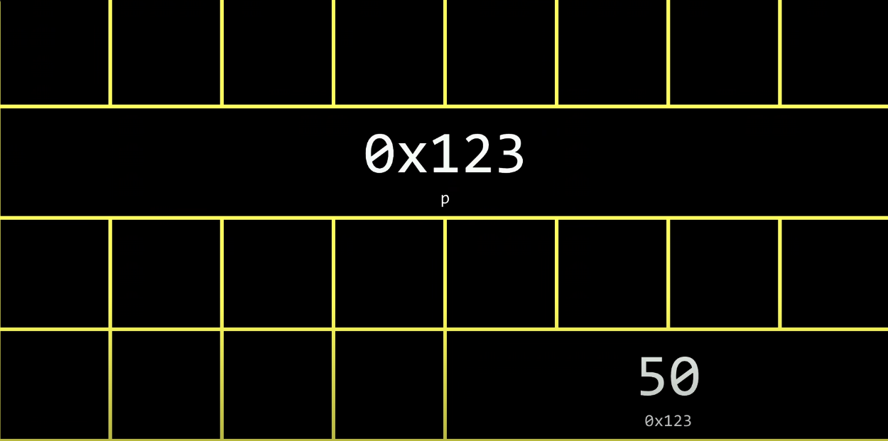

# Memory

 像素颜色是由一组十六进制数来表示的

一张图片是由一组像素数组组成的


```c
0 1 2 3 4 5 6 7 8 9 a b c d e f //十六进制 0xFF
```


在计算机内存中,常使用16进制作为内存的地址


## 在c语言中,操纵地址的运算符 **&**和*****

& : 引用,取地址

\* : 解引用,析地址


```c
#include <stdio.h>

int mani(void){
    int n =50;
    printf("%p\n", &n);
}		//打印n的地址
```



 在现代计算机中,指向int的指针*p一般需要8个字节储存以能访问到计算机的每个地方,p中储存的是地址,解析地址其值为50


## 数组和指针的关系

在c语言中," "表示一个字符串(String),他会在字符串的末尾自动添加'\0'

如果使用' ',它表示一个字符(char),不会在末尾添加'\0',因为它只包含一个字符


在string中,string本身储存了字符串第一个字符的位置,只要知道'\0'为字符串的终点即可,在cs50中我们可以直接通过string[]来访问单个字符的原因是

```c
typedef char *string
```

cs50的库将字符串定义为一个字符数组

```c
char *str = "Hello";
char firstChar = str[0]; // 访问字符串的第一个字符 'H'我们也可以通过这种方式访问字符串的单个字符
str[0] = 'A'; // 这是非法的，会导致未定义的行为,因为字符串的字面值是常量

//如果你想要改变字符串,你可以这么做
char str[] = "Hello";
str[0] = 'A'; // 这是合法的，会将字符串修改为 "Aello"

```


```c
int main(void){
    int n = 50;
    int *p = &n;
    printf("%i\n",*p);
}
```

在示例中,*被用作两个不同的功能:

1. 作为声明指针
2. 作为析地址符


## 指针运算

因为数组在内存中的长度是固定的,所以我们可以通过对指针进行运算来遍历数组(或者其它事情)

```c
int main(void){
	char *s = "HI!";
    printf("%c\n",*s);
    printf("%c\n",*(s+1));
    printf("%c\n",*(s+2));
}
//输出HI!
```

在计算机中,程序拥有不同的内存块,如果一个程序越界读取了其他程序的内存块,会引发 越界(在c语言中)


