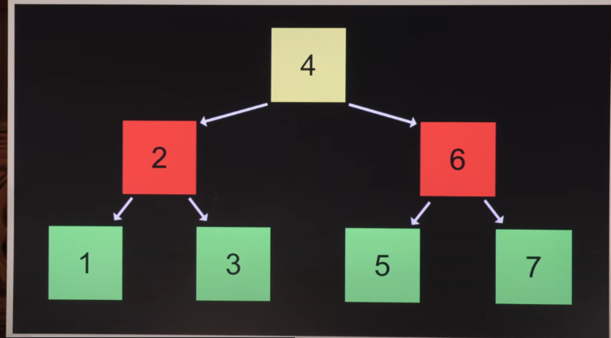

# Data Structures

两个核心操作:入栈和出栈


##FIFO

先进先出


## LIFO

后进先出


## 分配内存

```c
int *list = malloc(3 * sizeof(int));

int *tmp = realloc(list , 4 * sizeof(int));//分配四整型的空间并将list复制进去
```

* 使用临时变量的原因是,如果直接使用原变量,当你分配内存失败的时候,会返回null指针,你不能将一个null执政分配给一个分配了空间的指针,会导致内存错误
* 所以可以先使用临时变量,通过判断临时变量是非为null,确定不是null后再分配给list


我们可以使用`.`来获取一个变量内部的值,也可以通过 `- >` 来获取一个变量内部的值


## 链表

```c
typedef  struct
{
	int number
    struct node *next; //因为node是你自己定义的类型,所以你需要使用struct来告诉编译器你使用了自己定义的数据类型
}node;
```

* 对于这些不连续的内存空间,我们不能通过数字索引直接查找他们


```c
(*n).number = 1;
n - > number = 1; //n指向number
//两者语义一样
```

然后将n赋予list


当然,我们必须检查内存溢出的情况

```c
node *n = malloc(sizeof(node));
if( n == NULL ){
    return 1;
}//如果指针分配失败,则立即退出程序,说明内存不足
```

新的问题产生了:如果我第一次分配内存是成功的,但是我第二次分配内存或是第三次分配内存失败了,我直接退出程序了,那我第一次第二次分配的空间呢?它们并没有被回收.

**所以我们需要确保所有的情况,并回收垃圾**


那么,我们该如何释放内存空间呢?

```c
while ( ptr != NULL){
    node *next = prt -> next;  //防止指针丢失
    free(ptr);
    ptr = next;
}
```


列表查找的平均复杂度是O(n)

列表的插入平均复杂度也是O(n)


## 树 

我们不能决定链表在内存中的物理位置

但是我们可以通过树决定链表内容的逻辑位置

所以 人类 发明了 二分排序树


 

当我们要查找一个数的时候,进行以下判断

* 如果根节点大于该数,return search(右节点)
* 如果根节点小于该数,return search(左节点)
* 如果根节点等于该数,return true
* 如果根节点等于NULL,return false


关于树有很多的变种,可以增加节点让树能寻找它的父亲节点

对树来说,我们还需要使其保持平衡,否则树会退化成链表


## Hash

哈希是一种映射,将一个十分大的数集转换成多个小数集,以增加查找速度

哈希本质上是一种数组

但是代价也很明显:我们需要大量的空间来储存它

* Hash中的三元组
* 储存了人名,这个时候我们不需要再查找人名一个一个对比,因为人名隐含在了Hash中


\

但是当两个重名的情况发生时,又出现错误了

​                                                                                                                                                                                                                                                                                                                                                                                                                                                                                                                                                                          
