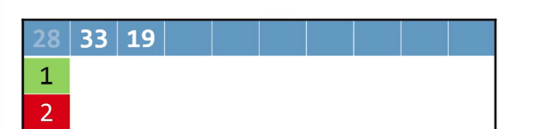

# Data Structures

四种数据结构

* 数组
  * 如果插入或删除一个数,需要大量的计算
  * 如果查找,不需要迭代
  * 使用冒泡排序,二路归并等算法
  * 大小固定
* 链表
  * 插入和删除十分方便
  * 查找需要递归
  * 不再有随机访问
  * 很难排序
* 哈希表
  * 插入需要通过哈希码进行运算
  * 删除十分简单
  * 递归时间复杂度比链表简单
  * 查找范围简单
* 树
  * 构建树十分复杂,但时间固定,因为是人为原因
  * 插入和删除十分简便
  * 查找时间取决于其长度
  * 在创造时即排序
  * 5555 占用空间很大


# Structure

我们可以定义各种自己的数据结构


```c
struct car *mycar;

(*mycar).year = 2011;
strcpy((*mycar).plate, "CS50");
(*mycar).odometer = 50505;

struct car *mycar = malloc(sizeof(struct car))
```


# Singly-Linked Lists

单向链表

在我们定义一个链表时,我们在结尾需要重新定义它的名字

```c
typedef struct sllist{
    VALUE val;
    struct sllist* next;   //不能使用sllnode,因为在这段代码之前没有提到过sllnode
}
sllnode
```

其中 `struct`表示使用`sllist`这种数据结构

而`sllnode`表示,将`strcut sllist`代替成sllnode,这样就不需要每次都需要使用struct了


关于链表,需要知道以下几点

* 增删改查
* 可视化
* **代码实现**


## Doubly-Linked List

双向链表与单项列表基本相同

我们需要知道它的增删改查


# Hash

哈希表的平均插入时间: O(1)

平均删除时间O(1)

平均查找时间O(1)


哈希表的目的是提供高效的数据检索操作

但是如果想要将哈希表中的元素进行排序,那会十分不方便

* 首先,哈希表通过哈希算法得到一些非负整数,称为哈希码
* 然后通过我们设计的数据结构储存他们


## 哈希码

我们需要一个公式,使数据和哈希码能一一对应


当产生两个哈希码为6时,发生了碰撞

这个时候,我们只能将它放到7的位置,当大量的数据发生碰撞,就和数组没有什么区别了

所以我们可以指定hash函数所储存的位置是一个链表的头节点,即我们可以加入任意长度的内容到hash函数中(如图所示)


# Trees

树的核心是节点

* 子节点
* 双亲系节点
* 不必处理冲突情况
* 树和哈希表本质上都是对逻辑方式的不同展示


# Queues

队列是FIFO即先进先出结构

```c
typedef struct_queue
{
    VALUE array[CAPACITY];
    int front; //已经出队列的数
    int size; //表示队列的大小
}queue;
```

 


# stacks

堆栈是LIFO(last in first out)后进先出结构

* 堆栈可以删除最近添加的元素
* push()入栈
* pop()出栈

```c
typedef struct_stack
{
    VALUE array[CAPACITY];
    int top;
}stack;
```


