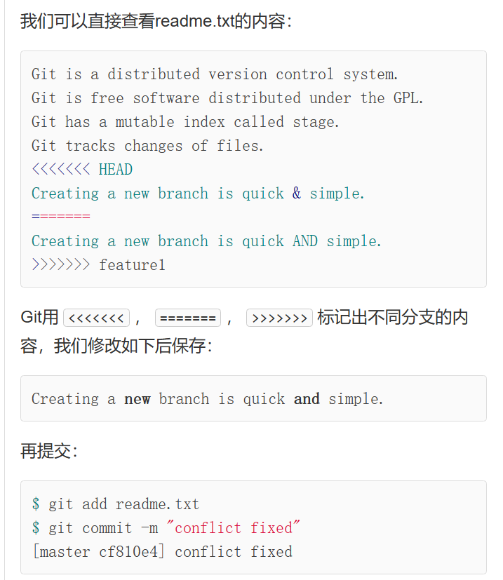

分支是用来为你创造一个属于你自己的分支,这样可以不会影响到别人的工作,也能保存你的代码


# 创建与合并分支

用一个图片可以形象的描述`HEAD`和`master`


每次提交,master都会向前移动一步


当我们创建新的分支`dev`时,就变成下图

```shell
git checkout -b dev  //-b表示切换分支
或者
git switch -c <name> //两者皆可
Switched to a new branch 'dev'
```


这样,当我们的每次提交都是针对dev的了

```shell
git checkout master
```


切换回`master`分支后，再看文件，刚才添加的内容不见了！因为那个提交是在`dev`分支上，而`master`分支此刻的提交点并没有变

当我们的工作完成了,就需要合并

```shell
git checkout master   //用于切换head到当前分支
git merge dev  //用于合并指定分支到当前分支
```


我们当然可以删除`dev`分支

```shell
git branch -d dev
```


# 合并中的冲突

一张图片可以很清晰的了解这种冲突


这种情况下,git无法执行快速合并

所以需要手动解决冲突



解决冲突就是把Git合并失败的文件手动编辑为我们希望的内容，再提交。

# 分支管理策略

合并分支时,git会用`Fast forward`模式

在这种模式下,删除分支后,会丢掉分支信息


使用`--no-ff`方式的`git merge`


一般来说,在工作中,是这样子的


有一个稳定版本master,一个测试版dev

每个人由自己的时间轴,完成后先合并到dev,最后再合并到moster


# BUG分支

当你想要修复一个bug,但是碍于手头还有工作,你没办法重新开一个新的分支,但是完成这个工作需要2h,你只有1h的时间来修复bug,怎么办?


办法就是使用`stash`来保存现场

也就是说,`git stash`可以保留你的工作现场


```shell
git stash	//保留现场
git checkout master		//回到目标分支
git checkout -b issue-101	//创建临时分支

...修复完成后
git switch master		//完成合并
git merge --no-off -m "fixed"  //删除
```


新的问题:dev是不是也有一样的bug??

* 我们还需要去重新修改吗?

很明显这不是高效的,即我们可以cv大法

```shell
git cherry-pick <刚才提交的ID> //将刚才的提交的id复制过来
```

**git能自动帮你提交你想复制的commit**


好了,现在恢复现场吧

```shell
git switch dev  	//切回分区

git stash list		//查看刚才保存的现场
git stash apply		//恢复不删除现场备份
git stash pop		//恢复并删除现场备份
```


# 看看怎么强行删除一个分支(即未提交)

`git branch -D <name>`


# 远程和本地仓库的一一对应问题

一般来说,当你pull远程抓取一个项目,会自动将远程分支和你的本地分支关联


如果要你手动关联呢?

```shell
git checkout -b <branch-name> origin/<branch-name>
//在本地创建和远程分支相对应的分支
```


建立本地分支和远程分支的关联

```shell
git branch --set-upstream branch-name origin/branch-name
```


# 两人同时提交同样的修改导致的commit冲突问题

先用`git pull`抓取最新的更新,然后在本地合并,手动解决冲突,再推送

如果失败了呢?

那一定是没有指定本地`dev`和远程`dev`链接

```shell
$ git branch --set-upstream-to=origin/dev dev
```

