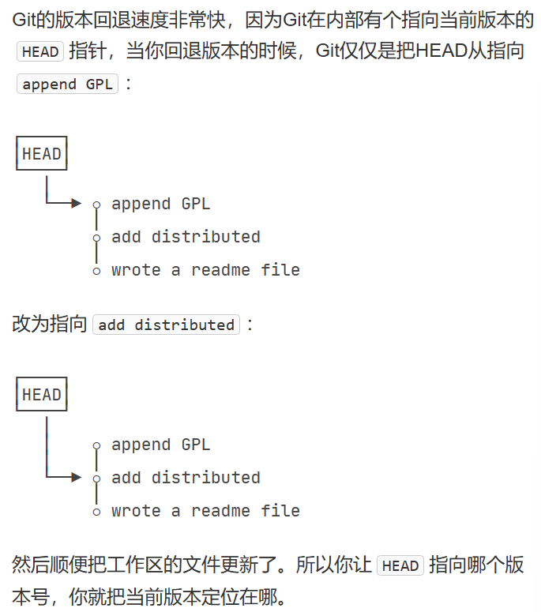
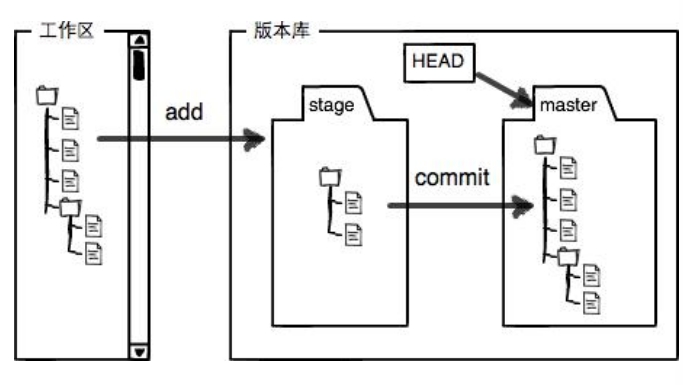

# 查看你的历代更新

```git
git log
```

可以查看日志


# 我想回退我的版本,我该怎么做

首相,当你每次git你的code的时候,git会自动创建一个日志,包含了:

* 提交者名字和邮箱
* 此次版本更新的代号,由git随机生成,原因是为了能多用户同步
* 此次版本更新的内容,在你commit 时输入的内容此时起作用了


```git
gigt reset --hard HEAD^
```

你此时的版本,有个简称,指向了HEAD

你想回退的版本,如果你想回退到前一个版本,那就使用一个`^`,如果想回退两个,则使用`^^`,以此类推,当然也有简便方式`HEAD~2`

或者直接找编号"--hard "编号""*写全?不会有如此愚蠢的 设计*



# 我后悔了,我要撤回我的版本回退请求

```git
git reflog
//查看你回退版本的id
git reset
//乘着时光机返回!
```


# 工作区和暂存区



git自动给我们创建了第一个分支`master`,这是在你安装git的时候设置的默认模式,以及一个指向master的`head`


# git工作原理

**管理修改**

顾名思义,git只负责提交你commit的文件,也就是说,如果在你add后修改了你想commit的文件,那么你commit的时候只会提交你的修改之前的文件


# 删除文件

当时删除一个文件的时候,git会立即发现这个问题

* 如果你确实要删除这个文件

```git
git rm <filename>
git commit -m "message"
```


* 很不幸你删错了

```git
git checkout  --text.txt
```

实际上就是从版本库覆盖一下


