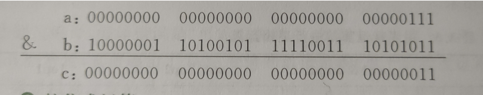
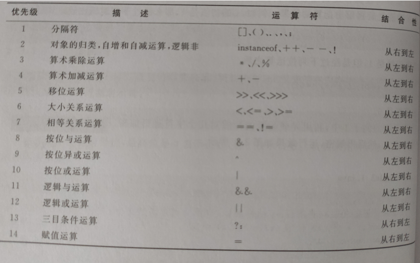

# 运算符和表达式

++x  使用前先增

x++ 先使用后增


* &&  与

* I I   或

* !  非


短路运算符:  && 有false 为false 

​          | | 有true为true        不再计算后面的公式

 

位运算符

​       在java中 一个int类型占4字节   00000000 00000000 00000000 00000111         -->数字7

​                    复数用补码的形式储存 11111111 11111111 11111111 11111000          -->数字-7

​               补码即 0-->1 1-->0  

​               左边最高位为符号位,**最高位是0表示正数 最高位是1表示复数**


1. 按位&运算

​              有0为0



2. 按位 | 运算

​                 有1为1  

3. 按位~运算  单目运算符!

​                 1-->0 0-->1

4. 按位异或 ^ 运算

​                 a,b对应位相同为0,否则为1

**位运算符和逻辑运算符的区别是:位运算符必须在所有运算结束后才操作,而逻辑运算符不需要**




# 语句概述

1. 方法调用语句

System.out.println( "  " );

2. 表达式语句

x = 23;

3. if条件分支语句      **切记看清是否有括号**

   ```java
     if(表达式){
                   语句
                           };
       else{
                   语句
                            }
   ```

4. switch开关语句

   ```java
   switch(表达式)
   {
   case 常量1:
           若干语句
           break;
       case 常量2:
           若干语句
           break;
   }
   ```

5. 循环语句

```java
for(表达式1;表达式2;表达式3){
                                若干语句
                                         }
增强型For循环  :for(type element(局部变量) : arrays(集合对象)){
                 sysytem.out.println(element);
}
```

6. while循环语句

   ​     while(表达式){

   ​                    若干语句

   ​              }

   ​        do - whlie循环语句

7. break和continue语句

>break :整个循环结束
>
>continue:单次循环结束

8. JDK对java的**优化**:

* 遍历数组

传统方式:for(int n = 0;n< b.length;n++)

改进方式:for(int n:a);