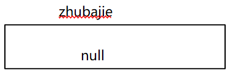
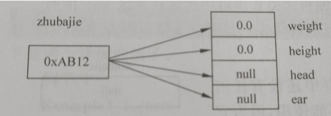
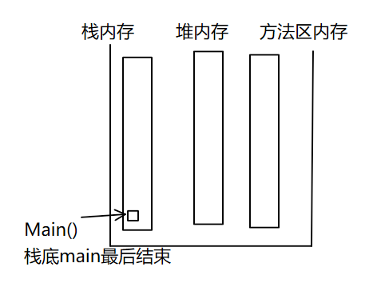
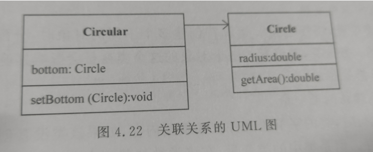
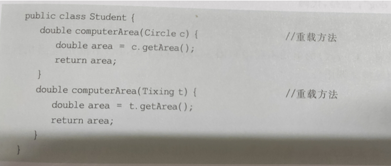
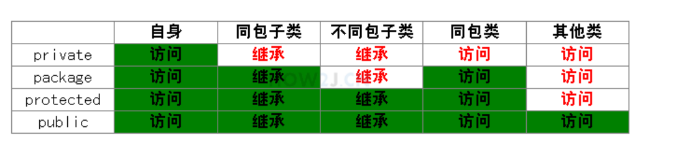
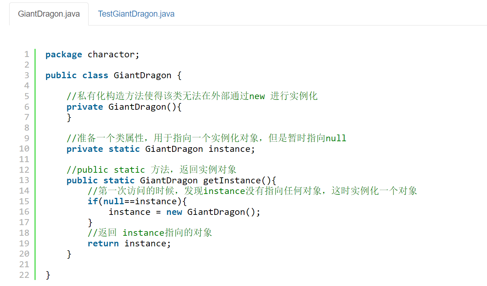

# 类

类声明的变量称为对象变量,简称**对象**.

 

类的定义包括两部分: 类声明和类体

```java
Class 类名{

  类体的内容

}
```


类名必须是合法的Java标识符

 

变量的声明: 用来储存属性的值

方法的定义: 给出算法

 

成员变量:      在整个类的所有方法里都有效,和位置无关

1.类型: 可以是Java中的任何一种数据类型,包括基本数据类型,引用类型:数组,对象和接口

2.成员变量的默认值和有效范围: 

| 关键字  | 默认值 |
| ------- | ------ |
| boolean | False  |
| byte等  | 0      |
| char    | '\0'   |
| float等 | 0.0    |
| 引用型  | null   |

 

人们习惯先介绍属性再介绍行为

注意: 若形如 "float bottom = above + 10;"则 above要声明在bottom前面


3.编辑风格

避免相似的字符 如 1和 I

# 方法(类的一部分)

方法的定义包括两部分:方法头和方法体

```java
方法头  {
         方法体的内容
}

1.方法头

Int speak()          //无参数的方法头
{
}

Int add(int x,y,z)  //有参方法头
{
}
2.方法体

包括局部变量的声明和Java语句,即方法可以对成员变量和方法体中声明的局部变量进行操作

局部变量只在方法中有效,与声明位置有关,方法内的局部变量在他声明后才开始生效

```

###区分成员方法和局部变量

1. 如果局部变量的名字和成员变量的名字相同,那么成员变量被隐藏,即该成员变量在这个方法内暂时失效

2. 如果方法中的局部变量的名字和成员变量名字相同,那么方法就隐藏了成员变量,如果想用该成员变量,

​         必须使用关键字 this(以后会讲)  this.x

3. 局部变量没有默认值

 成员变量有默认值,但是局部变量没有默认值

因此:使用局部变量时必须保证有具体的值

 

!!!注意:   int a = 12;  //可行,在声明的同时指定a的初值

​         int a;

​        a = 12;

​                  //不可行,这是赋值语句,不是变量的声明,只能出现在方法体中

#构造方法和对象的创建

对象:用类声明的


> 在用类声明对象之后,还必须创建对象,声明具体属性
>
> 通俗的讲,类是创建对象的模板,没有类就没有对象

###构造方法

1. 构造方法

* 类中的构造方法的名字必须和它所在的类的名字相同
* 没有类型
* 允许创建若干方法,但是必须有不同
* 如果没有编写构造方法,系统默认只有一个构造方法:无参数,无语句
* 如果有构造方法,那么java不提供默认的构造方法

2. 默认构造方法和自定义构造方法

   ```java
   class Point{
       int x,y;
       Point(){
           x=1;
           y=1;
       }
       Point(int a,int b){
           x=a;
           y=b;
       }
   }
   ```

   3. **构造方法没有类型**

   如果有返回类型,那么就不是构造方法

###创建对象

1. 对象的声明

一般格式:类的名字  对象名字

2. 为声明的对象分配变量

   ```java
   定义了Point(int a,int b)
       那么就不可以 p1 = new Point(  );
   //如果类定义了一个方法,呢么Java不提供默认的构造方法
   ```

3. 对象的内存模型

   * 声明对象时的内存模型

     A zhubajie

     

   * 为对象分配内存后的内存模型

   如果没有执行初始化操作,就分配默认内存

   类似C语言,会有一个地址

   

4. 创建多个不同的对象

不同对象占据的内存空间不同

###总结

new  运算是对类构造方法的运算,结果是一个**地址**:十六进制的数

## 类内存和堆内存

>方法在执行过程中,JVM中的内存时如何分配的


(1)方法只定义不调用,也不分配空间

(2)JVM内存划分有三块主要内存空间

* 方法区内存
* 堆内存
* 栈内存

(3)关于栈数据结构

* 栈 stack是一种数据结构
* 数据结构是反应数据存储状态的
* 数据结构是一门独立的学科,不属于编程的范畴
* 常见的数据结构
  - 队列
  - 栈 
  - 链表
  - 二叉树
  - 哈希表

(4)方法代码在方法区中,方法执行的时候,执行的内存在那里分配?

* 方法代码片段属于**.class**文件中的一部分,在加载文件时,放在方法区中,所以**JVM方法区最先有数据**
* 方法区内的代码片段可以被重复调用

在**栈内存**中分配**方法活跃的场所**     类加载器 --->方法区--->站内存

方法在调用时压栈,执行结束后弹栈

(5)JAVASE中自带的类,String,class这些类的类名时标识符




**栈**:存取速度比堆快,需告知生存期

**堆**:可以动态分配内存的大小,无需告知生存期

# 使用对象

> 使用访问服 **.** 调用对象

(1)对象自己操作自己的变量

对象.变量;

(2)对象调用类中的方法

对象.方法

(3)体现封装

使用 . 体现封装; 对象的引用和实体

1. 避免使用空对象
2. 重要: 在Java中允许使用  例如 object1 = object2;
3. 垃圾收集 

释放实体占有的内存

c++中有析构方法释放内存,而Java的运行环境就有 垃圾收集制

## 类和程序的基本结构

java程序 以 类为单位

一个源文件 可以被多个Java程序使用

每个源文件都是一个单独的编译单位

# 参数的传值

1. 传值机制

   形参 传递到 实参

2. 基本数据类型的传值

   调用方法时 讲数据传输给形参

3. 引用数据类型

   * 数组
   * 对象
   * 接口

   传值传递的是 引用而不是实体

   可变参数:不给出开始和最后的参数名字和个数,但是所有参数类型都相同

   ```java
   public void f(int...x)//可变参数使用下表运算表示具体参数
   public int getSum(int...x){
       int sum = 0;
       for(int i=0;i<=x.length;i++){
           sum+=x[i];
       }
       return sum;
   }
   ```

* 如果一个变量是基本类型

比如 int hp = 50;

我们就直接管hp叫变量

= 表示赋值的意思

* 如果一个变量是类类型

比如 hero h = new Hero( );

我们就管h叫做引用

=不再是赋值的意思

=表示指向的意思

比如 Hero h = new Hero( );

这句话的意思是

引用 h,指向Hero 对象

## 区分引用传递和传值

1. 对于基本数据来说,使用的是值传递,即复制了一份被封
2. 如果传值的是两个对象,其本质也是传值,将一个对象的地址复制一份,然后传递给另一个对象


3. java没有引用传递,传递的是引用的副本而不是引用本身,所以引用没有传递,不叫引用传递
4. 所以只要区分传递的是  **值** 还是 **地址**就可以分清了 

# 对象的组合

> 一个类的对象 将其他类的对象作为自己的对象

1. 关联关系

A的成员变量是用B类声明的对象



2. 依赖关系

   A的某个方法的参数是用B类声明的对象或某个方法返回的数据类型是B的对象

    实例成员和类成员

   成员变量可以细分为实例变量和类变量

   * 类变量:用static修饰
   * 否则为实例变量

###实例和类

*实例变量和类变量的区别*

1. 不同对象的实例变量互不相同
2. 所有对象共享类变量
3. 通过类名直接访问类变量

​     *实例方法和类方法*

1. 对象调用实例方法仅仅是共享类方法

```java
Hero h1= new Hero();
Hero h2 = h1; //h2指向h1所指向的对象
Hero h3 = h1;
Hero h4 = h1;
Hero h5 = h4; 
//h1,h2,h3,h4,h5 五个引用,都指向同一个对象
```

类方法在加载时就分配了相应的入口地址,从而类方法可以直接通过类名调用

类方法不能操作实例变量(**因为类创建对象之前实例成员变量还没有分配内存)

###方法重载

*  必须要某个地方不同
* 构造方法也可以重载



# this关键字

this 关键字出现在类的构造方法中,代表使用该构造方法创建的对象

this.成员变量;

当static成员变量出现时,默认格式是: 

类名.成员变量;

通过this关键字可以解决成员变量和局部变量冲突问题

使用this可以 使用成员变量

# 包

> 包是Java语言有效地管理类的一个机制

 如果用户想区分这些类,需要提供一个包名

package 包名;

包名可以是一个合法的标识符,也可以是若干个标识符加 "."分隔而成

 例:   package.com.cn

 

如果程序使用了包语句,例如 package tom.jiafei;

 那么必须保存在 …./tom/jiafei 的 目录中

 

* 使用 import 语句  让一个类使用其他类声明的对象作为自己的成员或方法中的局部变量

1. 不在一个包内

import 路径;

注意:系统会自动引入 java.lang包中的类

如果没有用import语句引入包中的类,也可以直接带包使用类 

​         java.util.Date date = new java.uitl.Date;

2. 引入自定义包中的类

  需要左对齐,即所对应的 父路径要相同

# 访问权限

访问权限修饰符

* private 私有的
* protect
* public 公共的

###**访问修饰符只能修饰成员变量,不能修饰局部变量** 

1. 私有方法和私有变量(private)

不可以被其他对象使用

2. 公有变量和公有方法
3. 友好变量和友好方法(什么都不加)

如果一个类和另一个类在同一个包中,那么对象可以访问自己的友好变量和友好方法

即在同一个包中可以使用

4. 受保护的成员变量和方法

   和这个类在同一个包中,都可以通过类名访问其中的方法

访问修饰符按访问权限从高到低是

public -->protect-->友好的--->private


* 属性通常用private封装起来
* 方法一般使用public用于被调用
* 会被子类继承的方法,通常使用protected
* package用的不多,一般新手会用package,因为还不知道有修饰符这个东西


作用范围最小原则:

尽量把数据封装起来,没有必要露出来的就不用露出来了

[private是不可见而不是不能继承](https://blog.csdn.net/qq_40581076/article/details/105055297?ops_request_misc=&request_id=&biz_id=102&utm_term=%E5%86%85%E9%83%A8%E7%B1%BB%E7%9A%84%E7%BB%A7%E6%89%BF&utm_medium=distribute.pc_search_result.none-task-blog-2~all~sobaiduweb~default-8-105055297.142^v63^js_top,201^v3^control_1,213^v1^control&spm=1018.2226.3001.4187)



# 对象数组和jar文件

使用对象数组,即数组的元素是对象

 Student [ ] stu;

Stu = new student[10];

注意:此代码只是定义了10个student对象,但都是空对象,需要实例化

### jar文件

 文档性质的jar文件:

可以将有包名的类字节码文件压缩成一个 jar文件,供其他源文件用import语句导入jar文件中的类

 方法:

1. 编写清单文件

Qingdan.mf

Manifest-version: 1.0   manifest-version和1.0之间只能有一个空格

Class: 需要添加的类      class和类之间,只能由一个空格

Create-by: 14           crate-by和14之间只能有一个空格 

2. jar命令

Jar 文件名.mf 生成一个jar文件

3. 运行

Java -cp加载程序需要的jar文件中的类

可运行的jar文件

可以将一个java应用程序中的类全部打包到一个jar文件中,最后使用jar文件命令运行这个jar文件

# 饿汉单例模式

```java
package charactor;
 
public class GiantDragon {
 
    //私有化构造方法使得该类无法在外部通过new 进行实例化
    private GiantDragon(){
         
    }
 
    //准备一个类属性，指向一个实例化对象。 因为是类属性，所以只有一个
 
    private static GiantDragon instance = new GiantDragon();
     
    //public static 方法，提供给调用者获取12行定义的对象
    public static GiantDragon getInstance(){
        return instance;
    }
     
}
public class TestGiantDragon {
 
    public static void main(String[] args) {
        //通过new实例化会报错
//      GiantDragon g = new GiantDragon();
         
        //只能通过getInstance得到对象
         
        GiantDragon g1 = GiantDragon.getInstance();
        GiantDragon g2 = GiantDragon.getInstance();
        GiantDragon g3 = GiantDragon.getInstance();
         
        //都是同一个对象
        System.out.println(g1==g2);
        System.out.println(g1==g3);
    }
}
```

无论如何只会创建一个实例

#懒汉单例模式 (和饿汉单例模式不同)

Getlnstance 时才会创建




**饿汉式**是立即加载的方式，无论是否会用到这个对象，都会加载。

如果在构造方法里写了性能消耗较大，占时较久的代码，比如建立与数据库的连接，那么就会在启动的时候感觉稍微有些卡顿。

 

**懒汉式**，是延迟加载的方式，只有使用的时候才会加载。 并且有线程安全的考量(鉴于同学们学习的进度，暂时不对线程的章节做展开)。

使用懒汉式，在启动的时候，会感觉到比饿汉式略快，因为并没有做对象的实例化。 但是在第一次调用的时候，会进行实例化操作，感觉上就略慢。

枚举enum是一种特殊的类(还是类)，使用枚举可以很方便的定义常量

比如设计一个枚举类型 季节，里面有4种常量

public enum Season {

​    SPRING,SUMMER,AUTUMN,WINTER

}

如果用int,范围不在1-4,而如果使用枚举,就能使范围固定 

借助增强for循环,可以知道具体有哪些枚举类型
