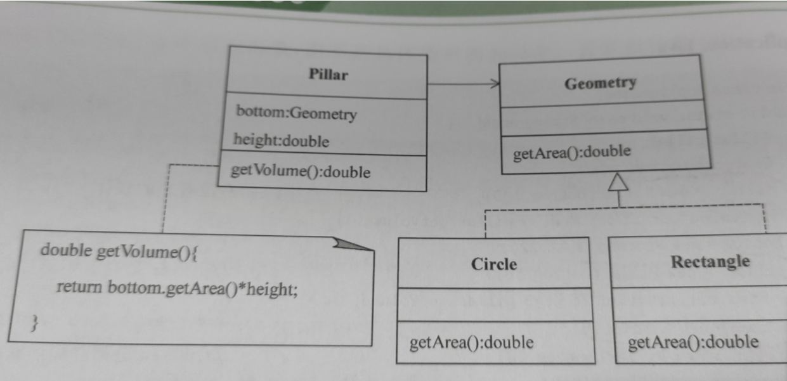
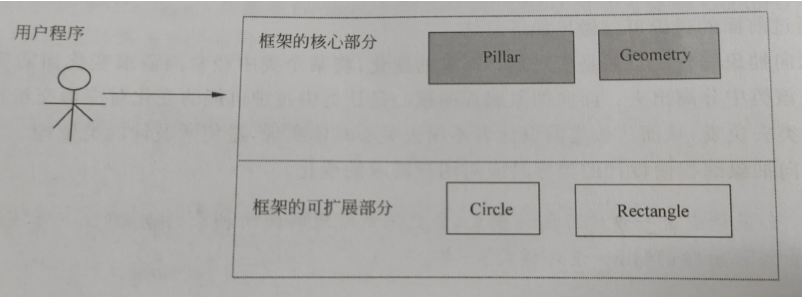

# 子类和父类

通过关键字extend 来定义一个类的子类

 

Class 子类名 extends 父类名 {

}

1. 子类自然地继承了其父类中不是private的成员变量作为自己的成员变量

2. 父类中的private 和友好访问权限的成员变量不会被子类继承

3. other类中用D创建一个对象 通过"."访问project变量和project 方法的权限如下

 (1):对于子类D自己声明的project成员变量和方法,只要other和D类在同一个包中

​     object对象就可以访问这些project成员变量和方法

 (2):对于子类D从父类继承的project成员变量或方法,需要追溯到这些project成员变量或方法所在的'祖先类'

4. 子类继承的方法只能操作子类继承的成员变量或未继承的成员变量,不可能操作子类声明的新变量

关于 instanceof运算符

 instanceof运算符是Java独有的双目运算符

当左边的操作元素是右边的类或其子类所创建的对象时,运算结果为 true

Zhang instanceof people

# 成员变量的隐藏和方法重写

###成员变量的隐藏

 如果声明的成员变量的名字和从父类继承来的成员变量的名字相同,在这种情况下子类就会**隐藏**所继承的成员变量

特点: 子类对象仍可以调用从父类继承的方法操作被子类隐藏的成员变量,也就是说 子类继承的方法所操作的成员变量一定是:

​          **被子类继承或 隐藏的变量**

子类继承的方法**不可以操作子类新声明的成员变量**,子类新定义的方法可以操作子类继承和子类新声明的成员变量 但无法操作**隐藏的成员变量**

 ### 方法重写(和父类方法一模一样)

子类通过方法的重写可以隐藏继承的方法,子类通过方法的重写可以把父类的状态和行为改变为自己的状态和行为

如果父类可以被继承,除了final,子类有权重写

一旦重写,那么该方法调用的一定是重写方法

 方法重写的意义:重写方法既可以操作继承的成员变量,方法,也可以操作子类新声明的成员变量,调用新定义的其他方法,但无法操作被子类隐藏的成员变量和方法   (子类新增或重写的方法操作的成员变量一定是子类新声明的成员变量)

方法重写和方法重载的比较:方法重写是和父类一模一样,方法重载可以有些许不同

 注意:方法重写不允许降低方法的访问权限,只能提高 public->protected->友好的 ->private

### super关键字

用super操作被隐藏的成员变量和方法

子类一旦隐藏了继承的成员变量,那么子类创建的对象就不在拥有该变量,该变量归super所有

 Super.x super.play(  ) 

**注意：不管是子类手动调用父类的无参构造方法，还是手动调用父类的带参构造方法，代码必须写在子类构造方法的第一行**

如果子类的构造方法没有明显地指明使用父类地哪个构造方法 子类就调用父类的不带参数的构造方法

 子类不继承父亲的构造方法,所以子类在其构造方法中需要使用super来调用父类的构造方法

​     即如果没有显式写出父类的构造方法,那么默认的有 :

​                     super(  );

使用格式super(参数),父类应写一个不带参数的构造函数;

重点注意!!! **子类继承父类的带参构造函数时,实例化时记得 加上该有的参数!**

​                     super(name);

​                     ADHero A = new ADHero("AD");

# final关键字和上转型对象

final关键字可以修饰类,成员变量和方法中的局部变量

final class A{

}

如果用final 修饰一个方法,那么这个方法不允许子类重写,也就是说,不允许子类隐藏可以继承的final方法(不允许篡改)

### 上转型变量

对象的上转型对象:当用子类创建一个对象,并**把这个对象的引用放到父类的对象中**

例如: animal a;  

​    tiger b = new Tiger(  );

​    a=b;

称作a是b的上转型对象

即对象的实体是子类创建的,但在父类中引用

但是上转型对象会失去对象原有的一些属性(比如老虎称作动物就失去了老虎的特性)

 ### 上转型对象的特点:

1. 上转型对象不能访问子类新增的成员变量(**失去了部分属性**),不能调用子类新增的方法

2. 上转型对象可以访问子类继承或者隐藏的成员变量,也可以调用子类继承的方法或子类重写的实例方法

​    当子类重写了父类方法,那么上转型对象调用的实例方法一定是调用的子类重写的实例方法

注意:不要混淆父类创建的对象和子类对象的上转型对象

​    可以将对象的上转型对象再强制转换为一个子类对象,这是该子类对象又具备了原有的功能和属性

​    **不能向下兼容**

​    如果子类隐藏了父类的静态方法,那么子类对象的上转型对象不能调用子类重写的静态方法,只能调用父类被隐藏的静态方法

# abstract类和abstract方法(抽象类)

用abstract修饰的类称为abstract类(抽象类)

 abstract class A{

}

用abstract修饰的方法称为抽象方法

abstract int min(int x,int y );

对于abstract方法,只允许声明,不允许实现(没有方法体),而且不允许 final和abstract同时修饰一个方法或类

​                                           也不允许 static和private修饰abstract方法或类

1. abstract方法中可以有abstract方法

abstract方法可以有abstract类,但是非abstract类不能有abstract方法

2. abstract类不能用new 标识符创建对象

 如果一个非抽象类是某个抽象类的子类,那么它必须重写父类的抽象方法,给出方法体

3. abstract子类

​       无所谓

4. abstract类的对象做上转型对象

尽管abstract类不能用new创建对象,但该对象可以成为子类对象的上转型对象,那么该对象就可以调用子类的重写的方法

5. 理解abstract类

抽象类可以抽象出重要的行为标准,抽象类封装了子类必须有的行为标准

子类根据抽象类中的行为标准给出具体行为

可以这样写代码 girl girl= new girlfriend;  girl是上转型对象

即abstract是面向抽象的编程


abstract只关心操作,不关心细节


使用多态进行程序设计的核心技术之一就是使用上转型对象

 

所谓抽象编程,就是设计类中的重要数据是抽象类声明的对象,而不是具体类声明的对象

# 抽象编程

需求:求一个柱体的体积

 

问题:底面积可能是圆,可能是三角形,也可能是长方形

解决方案:抽象类abstract类可以调用子类重写的方法

```java
public abstract class Geometry {
public abstract double getArea();
}
```

pillar是计算体积的方法

circle和rectangle是计算底的一个方法

设计application.java

```java
Pillar pillar;
Geometry bottom = null;
Pillar = new pillar(bottom,100);  //没有底的柱体

Bottom = new Rectangle(12,22); 
Pillar=new pillar(bottom,58);  //pillar 是具有矩形底的柱体

Bottom = new Circle(10);
Pillar = new pillar(bottom,58);

```

通过抽象类设计pillar,使pillar不再依赖具体类

# 开-闭原则

所谓Open-Closed Principle,就是让设计的系统对拓展开放,对修改关闭



如果将Pillar Grometry Circle Rectangle 看作一个小的开发框架

那么 Application.java 就可以看作使用该框架进行应用开发的用户程序



# 小结

继承是一种已有的类创建新类的机制


子类继承父类的成员变量作为自己的一个成员变量


子类继承的方法只能操作子类继承和隐藏的成员变量


子类重写或者新增的方法能操作子类继承和新声明的成员变量,但不能直接操作隐藏的成员变量(使用super

 

使用开-闭 原则

 

子类不能继承父类的构造函数,但是可以调用父类的构造函数,且只能调用父类的构造函数,在调用构造函数时,先调用父类的构造函数,再调用自己的构造函数

 

子类继承父类时,如果父类有 无参构造方法,则子类构造方法默认隐式调用父类无参构造方法

当父类没有 无参构造方法,子类的构造方法必须显示调用父类的有参构造方法

Super(a,b) 或者this(a,b)

 

如果父类的构造函数只有一个 而且是 private ,那么该父类不能被继承

 

Java中 一个子类只能有一个父类

 

final不能修饰抽象类,因为抽象类要子类继承然后实现方法.但是final修饰的类不能再被继承

static不能修饰抽象类,因为抽象类需要实例化,static方法不需要实例化,调用一个静态类是没有意义的

private不能修饰抽象类,因为抽象类的方法需要方法重写,private修饰的方法只能本类访问

 

**Private 修饰的变量和方法不是不能被继承,而是对子类不可见**

 

子类能继承父类的private修饰的方法,只是父类的private修饰的变量和方法对子类不可见,子类可以通过父类的方法调用private类