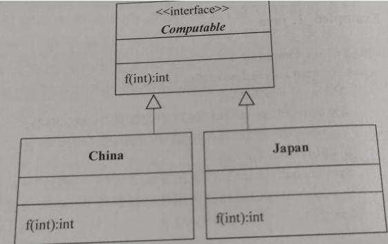
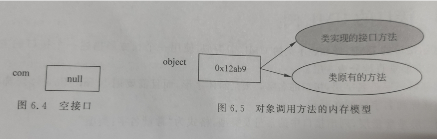
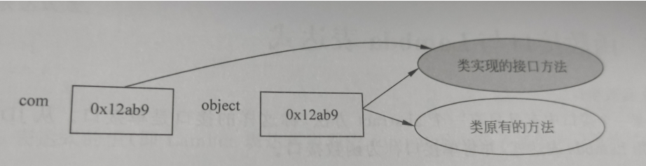

# 接口

使用关键字**interface**来定义一个接口

Inerface Com{

}

接口声明: interface 接口的名字

 

接口体: 接口体中所有抽象方法的**访问权限**一定是 **public**

​       允许**省略public**和 abstract**,即只有**抽象方法

​       接口中所有static 常量 访问权限一定是 public 允许省略 public final static

 所以接口中**不会有变量**

 

deflaut方法:

使用default 关键字,在接口中定义称作default的**实例方法**

**不可以定义default的static方法**

 

接口体中的static方法

允许在接口体中定义static方法

 

允许定义private方法,目的是配合接口中的default的**实例方法**

### Default默认方法

声明为default的方法叫默认方法

 

为什么会有默认方法:

没有默认方法前,如果接口中新增了一个方法,那么所有实现了这个接口的类都要改动

引入默认方法后,原来的类不用改动就能获得这个默认方法

增加了接口的可拓展性

# 实现接口

使用关键字 implements 声明该类实现一个或多个接口

 

class A implements Com,Addable

 

class Dog extends Animal implements Eatable,Sleepable

 

如果一个类实现了某个接口,那么这个类自然拥有了接口中的常量,default方法(也可以去掉default方法并重写)

重写接口中的方法:

如果一个非abstract方法实现了某个接口,那么这个类必须**重写该接口的所有abstract方法**(去掉abstract)

如果一个非abstract方法实现了某个接口,那么无影响

 

如果类实现了某接口,但类并不拥有接口的 static方法和private方法

**注意:** 重写接口时,不能省略public(因为降低了访问权限)

使用接口中的常量和static方法

可以用接口名访问接口的常量,调用接口的static方法

Com.MAX;

Com.f();

 

接口的细节说明:

如果interface前面加上了public关键字,这样的接口是一个public接口,可以被任何一个类实现

​             如果不加public关键字,称友好接口,可以被同一个包中的类实现;

 

如果父类实现的某个接口,那么子类也就自然实现了该接口,**不必再使用implements声明使用这个接口**

接口可以被继承,子接口将实现父接口中的全部实例方法和常量

 

Tips:Java提供的接口通过import语句到入包中的类和接口

​        import java.io.*;

 

接口的UML图

顶部的第一层是名字层,接口的名字

第二层是常量层,接口的常量和类型

第三层是方法层:方法名字(参数列表)

# 接口回调

用接口声明的变量叫做接口变量

接口属于引用型变量,在接口中可以存放实现该接口的类的实例引用

 

用接口声明一个变量 Com com;

"接口回调" 指 把某一接口的类创建的对象的引用赋值给该接口声明的接口变量,那么这个变量就可以调用被类实现的接口方法以及接口提供的default方法(或重写的方法)

接口回调无法使用类中的其他方法

# 函数接口和Lambda表达式

1. 函数接口

如果一个接口中有且只有一个abstract方法,称这样的接口是单接口

 

2. Lambda表达式

Lambda表达式就是一个匿名方法(函数)

 

computeSum()是一个方法

Int compteSun(int a ,int b){

Return a+b;

}

 

使用Lambda实现同样的功能

 

(int a,int b ){

 return a+b;

}

或者

(a,b) ->{

Return a+b;

}

Lamba表达式就是只写参数列表和方法体的匿名方法

(参数列表) -> {
           方法体

}

 

3. Lamba的值

Lamba的值就是方法的入口地址

因此,Lamba表达式主要用在单接口 

 

4. 接口变量存放lambda表达式的值

使用**接口变量**实现Lambda

public abstract int computeSun(int a ,int b);

 

SingleCom com=(a,b) ->{

Return a+b;

}

Int result = com.computeSun(10,8);

# 抽象类和接口的区别

区别1:

子类只能继承一个抽象类,不能继承多个

子类可以实现多个接口

 

区别2:

抽象类可以定义

Public,protect,package,private

静态和非静态属性

final和非final属性

接口中声明的属性,**只能是**

* Public
* 静态
* Final

(可以省略显式的声明)

 

但都可以有实体方法

# 小结

1. 接口的接口体中只可以有常量和abstract方法

2. 接口中只能存放实现该接口的类的实例的引用

3. 当接口变量中存放了实现接口的类的引用之后,接口就可以调用类中重写的接口方法

4. 如果一个类实现的接口和继承的类中有重名的方法,那么优先实现类中的方法

5. 接口的修饰列表只能有public,private,default,abstract,static and strictfp

6. 使用接口对象 实现Lambda方法