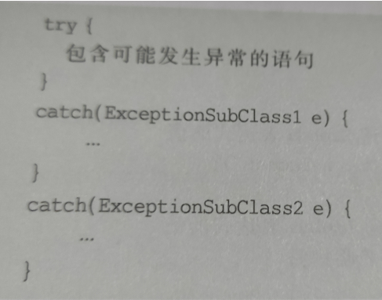

#内部类

类有两种重要的成员:

> 成员变量
>
> 方法

实际上java中还允许类有一种成员--------内部类

可以用protected和private修饰内部类

 

内部类和外嵌类之间的重要关系如下:

1. 内部类的外嵌类的成员变量在内部类中仍然有效,内部类可以调用外嵌类的方法

2. 内部类的类体中**不可以声明类变量和类方法**,外嵌体的类体中可以用内部类声明对象,作为外嵌体的成员

3. 内部类**仅供**它的外嵌类**使用**,使用访问修饰对内部类没有意义

4. 内部类的外嵌类的成员变量在内部类中有效


内部类可以被修饰为static内部类,这样内部类就是外嵌类的一种静态数据类型

程序可以在其它类中使用static内部类创建对象


**static内部类不能操作外嵌类中的实例成员**

* 内部类和外部类存在同名成员时,在内部类中默认是访问内部类的成员,可以通过"外部类.this.成员"进行指定访问外部类的成员


非内部类不可以是static类

# 匿名类

**匿名类一定是和final类**


和子类有关的匿名类

提问:如果没有显式地声明一个子类,又想用子类创建一个对象,如何实现?

答:匿名类


创建子类对象时,除了使用父类的构造方法之外还有类体,此类体被认为是一个子类去掉类声明后的类体,被称为**匿名类**


假设band是类,那么用bank的子类(匿名类)创建对象

```java
new bank(){
匿名的类体
}
```

其中new bank()表示子类的构造方法中使用了父类提供的构造方法(不带参的)

又比如new bank(100) {    匿名的类体 }  就表示使用了父类提供的带参的构造方法

### 匿名类的性质

1. 匿名类可以继承父类的方法,也可以重写父类的方法
2. 使用匿名类时,必然是在某个类中直接使用匿名类创建对象
3. 匿名类可以访问外嵌类的成员变量和方法,在匿名类的类体中不可以声明static成员变量和static方法
4. 由于匿名类是一个子类,且没有类名,所以在匿名类创建对象时要直接使用父类的构造方法


匿名对象的引用可以传递一个匹配的参数

```java
void showMess(Bank bank){}
```

该方法是bank类型,用户希望传递bank子类对象,但系统没有提供符合要求的子类,那么用户可以考虑匿名类

###和接口有关的匿名类

java允许使用接口名和一个类体创建一个匿名对象,这个对象被认为是实现了某个接口的匿名类

```java
new Computable(){
                实现接口的类体
}
class B{
Public void turnOn(接口a){}}

b.turnOn(new a(){
                  方法体});

```

**匿名类和lamba表达式很像,两者可以相互替代**


lamba的好处是:如果接口的名字改了,那么lambda中的表达式不用做任何修改


# 异常类

异常类就是程序运行时可能出现的一些错误

异常处理就是为了改变程序的控制流程,让程序有机会对**错误**做出处理

* java使用throw关键字抛出一个exception子类的实例来表示异常的发生

>Java.lang包中的Integer类型调用其方法public static int parseInt(String s)可以将"数字"格式的字符串转换成int数据
>
>但是将字符串"ab89"转换成数字时,
>
>Int number = Integer.parseInt("ab89");
>
>方法parseInt()在执行过程中就会抛出一个异常

* try-catch语句

java使用try-catch语句来处理异常


try----将可能出现的异常放在try部,一旦抛出了异常对象的方法和对象,那么立即结束运行

catch----程序可能发生的异常后的处理放在catch部分



各个catch参数中的异常类都是Exception的某个子类,表名try部分可能发生的异常,这些子类之间如果有父子关系,那么catch参数是子类在catch参数是父类的前面

 

自定义异常类

在编写程序时可以扩展Exception类定义自己的异常类,然后根据程序需要来规定那些哪些方法产生这样的异常.

一个方法在声明时使用**throws**声明**要产生的若干个异常**,并在方法体中给出相应的操作

catch的作用就是捕获throw关键字抛出的异常

 

注意:**throw时Java的关键字,作用是抛出异常.throw和throws是两个不同的关键字**

# 断言

断言语句一般用于不准备通过捕获异常处理来处理的错误

例如:让程序立即停止运行

 

1. 使用断言语句的语法格式

Assert booleanExpression;

当Boolean的值为true时,继续执行

否则停止运行

 

Assert booleanExpression:messageExpection;

当Boolean的值为true时,程序继续运行

否则抛出message提示用户出现了什么样的错误

 

2. 启用和关闭断言语句

当Java解释器直接运行时,**默认关闭**断言语句

在调试语句时可以使用-ea启用断言语句

 

 

###if和断言的区别

1. 断言是仅在debug版本起作用的宏

当断言的表达式为逻辑真时，程序才继续往下执行，否则，终止程序

2. 何时用断言？assert和if的区别

if下，所有的情况都是合理的，每一种合理情况用if-else分别处理，例如栈不空时进行出栈操作，栈空时跳出循环；

而断言下，是程序中的错误，遇到时必须终止程序。当检测到为逻辑假时，意味着我们假设的错误出现了。


# 小结

1. 匿名类有构造方法

2. 匿名类一定是final类

3. 内部类的外嵌类成员在内部类中仍然有效

4. 可以用private类或protected类修饰内部类