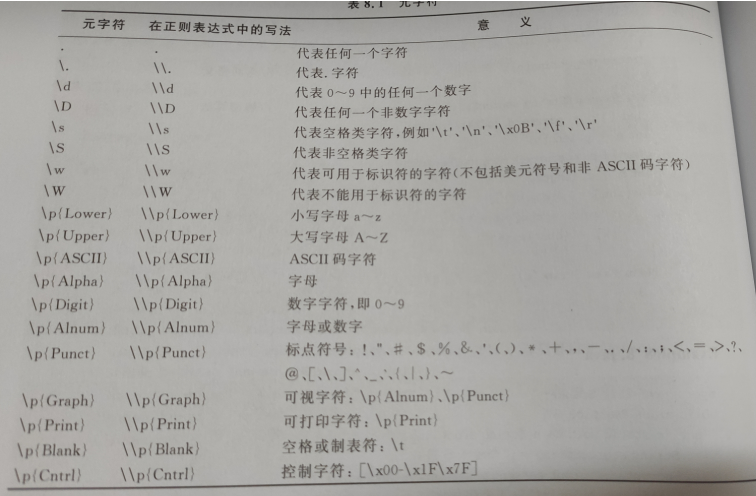
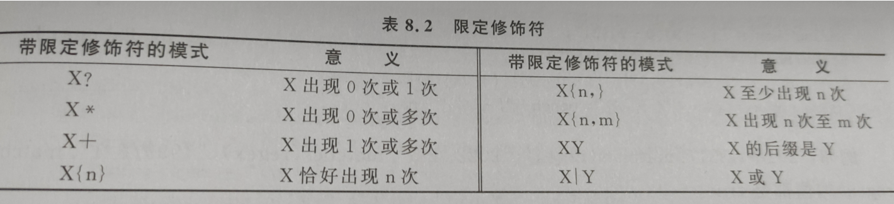

# String类

1.常量对象

String常量也是对象,是用""括起来的字符序列

 

Java把用户程序中的String常量放入常量池,常量池中的数据在程序运行期间不允许改变

 

2.String对象

使用string类声明并创建对象

String s = new String ("we are students");

 

对象s中存放着引用,表明自己的实体的位置

**凡是new出来的对象都不在常量池,在动态池中**

 

称String对象封装的字符序列为String对象的字符序列或String对象的实体

例如s封装的字符序列是we are students(s的实体)

 

String类有两个常用的构造方法:

1. String(char [a]): 用一个字符数组a中的一部分字符创建一个String对象

2. String(char a[],int startIdex,int count):提取字符组startIdex开始 count结束的字符

3.引用String常量

把String常量引用赋值给一个Sting对象

**4.String对象属于不可变对象**

String对象的并置

String对象可以用"+"进行并置运算

String testone = "a+b";

**参与并指运算的String对象只要有一个是变量,那么Java就会在动态区存放新的String对象的实体或引用**

String类的常用方法:

**1.public int length()**

使用length()方法来获取一个String对象的字符序列的长度

 

**2.public boolean equals(String s)**

对象调用equals(String s)方法比较当前对象的字符序列是否参与参数s指定String对象的字符序列相同

​    String tom = new String("天道酬勤");

​    String boy = new String("知心朋友");

​    String jerry = new String("天道酬勤");

​    tom.equals(boy)的值为false, tom.equals(jerry)的值为true

 

**3.public boolean startswith (String s) 和public boolean endswith(String s)**

判断当前String对象的字符序列前缀是否为s的字符序列

判断当前String对象的字符序列后缀是否为s的字符序列

 

**4.public int compareTo(String s)**

比较字符序列大小

想等 =0

大于返回正值

小于返回负值

 

**5.public boolean contains(String s)**

判断是否包含参数s 的序列

**6.public int indexOf(String s)和 public int lastIdexOf(String s)**

Tom.indexOf("a",2) 从第二个位置搜索最开出现的a

从零引索,首次(最后一次)出现

引索到返回位置

没有引索到返回-1

 

**7.public String substring(int startpoint)**

String tom = "我喜欢篮球";

String str = tom.substring(1,3);

复制tom 1-3字符序列并得到新的字符串

 

**8.public String trim()**

得到一个当前字符序列去掉空格后的字符序列

 

对象的string对象表示

一个对象调用toString()方法返回String对象称作它的String对象表示

一个对象调用toString()方法返回String对象的字符序列一般形式为:

创建对象的类的名字@对象的引用的字符序列串表示

 

对一个对象object

System.out.println(object);

等价于

 System.out.println(object.toString());

 

String的 getChar() 和 toCharArray()

getChar(int start,int end,char c[],int offset) 从start到end复制到c中的offset开始

toCharArray();      将s字符串化成数组放在某个数组中

 

加密算法

Char [ ] p=password.toCharArray();

# 正则表达式

正则表达式是一个String对象的字符序列,该字符序列中含有具有特殊意义的字符,这些特殊字符称作正则表达式中的元字符

String对象调用public boolean matches(String regex)方法可以判断当前String 对象的字符序列是否和参数regex指定的正则表达式匹配

正则表达式中可以用方括号括起来若干个字符表示一个元字符,表示方括号中的任何一个字符

 

正则表达式中可以用方括号括起来若干个字符表示一个元字符,表示方括号中的任何一个字符

例如:String regex= "[159]ABC"

​    那么"1ABC","5ABC","9ABC"都是和正则表达式regex匹配的字符

[abc]: 代表a,b,c中任何一个

[^abc]代表除了a,b,c以外的任何字符

[a-zA-Z]: 代表英文字母中的任何一个
[a-d]: 代表a~d中的任何一个

##常用的正则表达式

**1.匹配整数(十进制)的正则表达式regex**

String regex = "-?[1-9]\\d*";

 

**2.匹配浮点数的正则表达式regex**

String regex = "-?[0-9][0-9]*[.][0-9]+";

 

**3.匹配E-mail的正则表达式**

String regex = "[\\w+@\\w+\\.[a-z\]+(\\.[a-z]+)](file://w+@/w+/.[a-z]+(/.[a-z]+))?;

 

**4.匹配身份证号的正则表达式**

String regex = "[1-9][0-9]{16}[a-zA-Z0-9]{1}";

 

**5.匹配日期的正则表达式**

String year = "[1-9][0-9]{3}";

String month= "((0?[1-9])|(1[012]))";

String day = "((0?[1-9])|([12][0-9])|(3[01]?]]";

String regex = year + "[-./]" + month + "[-./]"+day;

# Scanner类

1.scanner对象

scanner对象可以解析字符序列中的单词

String NBA = "I LOVE THIS GAME";

 

为了解析出NBA的字符序列

Scanner scanner = new Scanner(NBA);

 

Scanner对象可以调用方法

useDlimiter(正则表达式)

 

Scanner对象调用next()方法依次返回被解析的字符序列中的单词

使用nextInt()或nextDouble()方法来返回int或double类型的数据返回

使用InputMismathException处理异常,使用next()方法返回非数字化单词

 

String regex = "\[^0123456789.]\+" //匹配所有非数字字符序列

 

## Pattern类和Matcher类

Java使用了专门进行模式匹配的Pattern类和Matcher类,

这些类在    java.util.regex 包中

 

以下是 pattern 使用教程

1.确定一个String对象为程序需要检索的数据源

 

String A = "xxx";

 

2.建立Pattern对象

String regex = "good";

pattern = Pattern.comlipse(regex);

 

3.得到matcher对象

Matcher mather = pattern.matcher(dataSource);

 

# 日期和时间类

日期和时间类

从JAVA SE8开始提供java.time包

 

LocalDate,LocalDateTime,LocalTime类都是final类,不提供修改数据的方法

 

1.LocalDate

LocalDate now()可以返回一个LocalDate对象,封装和本地**当前日期**有关的数据

LocalDate调用LocalDate of(int year,int month,int dayOfMonth)方法返回一个对象,封装和参数指定日期有关的数据

LocalDate dateNow = LocalDate.now();

LocalDate dateOther = LocalDate(1988,12,16);

2.LocalDateTime(可以封装秒等数据)

3.LocalTime()

只封装时,分,秒等数据

 

日期,时间差和日历类

计算时间差  long until(Temporal endExclusive,TemporalUnit unit);

 

日期格式化

format()方法

String format(格式化模式,日期列表);
