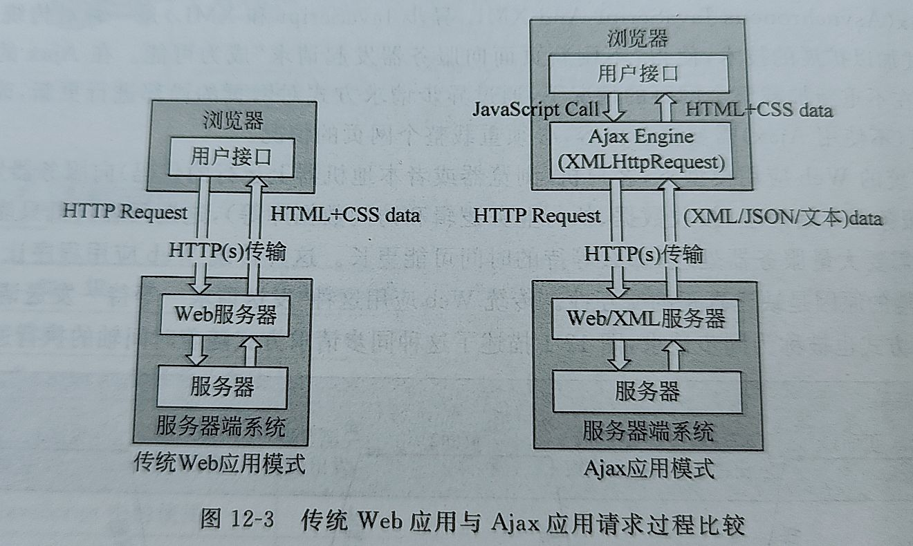

# Ajax

Ajax是一种对传统Web应用模式加以扩展的技术,使不刷新页面向服务器发起请求成为可能.

Ajax请求是异步的,非阻塞的.客户端可以在响应未到达前继续当前页面的其他操作.

* 使用HTML和CSS构建标准化的展示层
* 使用DOM进行动态显示和交互
* 使用XML或JSON等进行数据交换和操纵
* 使用XMLHttpRequest来和服务器进行异步通信
* 使用JavaScript将所有元素绑定在一起

## XMLHttpRequest介绍

是浏览器的一种高级特性,本质上是一个Javascript对象,是Ajax的核心.

属性:

* readyState:表示异步请求过程中的各种状态
* onreadystatechange:每次状态所触发事件的事件处理程序
* responseText:从服务器进程返回的数据的字符串形式
* responseXML:从服务器进程返回的XML文档数据对象
* status:返回的响应码

方法:

* abort():停止当前请求
* open(): 建立对服务器的调用,method参数可以是get,post,可以是URL
* send(): 向服务器发送请求

