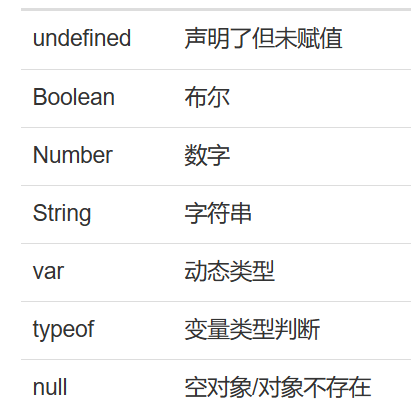
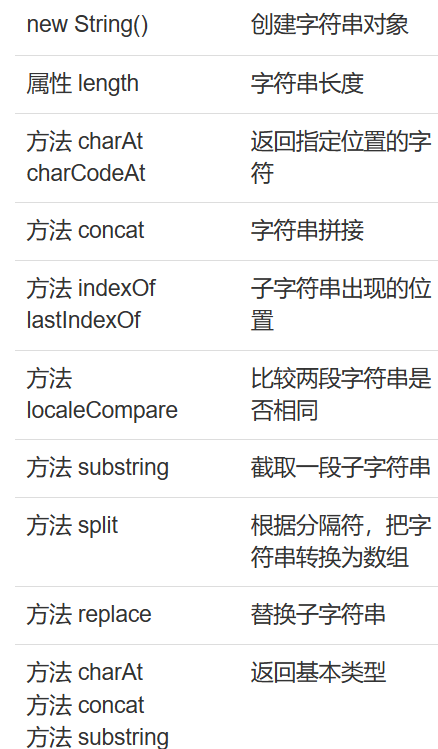
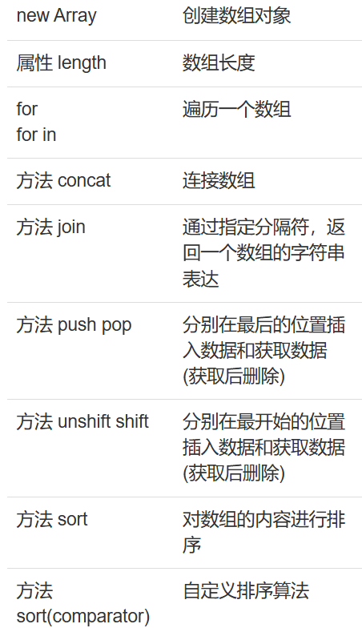
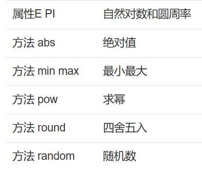

# Javascript

javascript用于网页和用户之间的交互,比如提交的时候,进行用户名是否为空的判断

完整的javascript由语言基础,BOM和DOM组成


## 例子

通过JavaScript向文档中输出文本

```javascript
<script>
  document.write("Hello Javascript");
</script>
```

**document**是javascript的内置对象，代表浏览器的文档部分
**document.write("Hello Javascript");** 向文档写入字符串


## 变量

使用var声明一个变量,这个变量是动态变化的,不同的初始化会有不同的类型

```javascript
<script>
  var x = 10;
  document.write("变量x的值:"+x);
</script>  //显示变量x的值为10
```




## 函数

格式:

function 名称 (参数列表){

​	函数块

}	


## 事件

鼠标点击事件:

```jsp
<script>
function showHello(){
   alert("Hello JavaScript");
}
</script>
 
<button onclick="showHello()">点击一下</button>
```


# 对象

JavaScript中的对象是有着属性和方法的一种特殊数据类型

常见的对象有数字Number,字符串String,日期Date,数组Array等

* 数字,使用Number()函数创建,如果输入的不是数字,则返回NaN
  * isNaN( )来判断是否输入的是非数字
  * toFixed( )设置小数点后的格式
  * valueOf( )返回数据类型
* 字符串等等

这些类似一个jar包,里面描述了各类方法








## BOM

BOM即 浏览器对象模型,包括 窗口,浏览器,客户端屏幕,访问历史,浏览器地址


### 窗口

```jsp
<script>
function openNewWindow(){
  myWindow=window.open("/");  //outerWidth查找浏览器宽度
}
</script>
  
<button onclick="openNewWindow()">打开一个新的窗口</button>
```


### 浏览器对象

提供浏览器信息

```jsp
<script type="text/javascript">
document.write("<p>浏览器产品名称：");
document.write(navigator.appName + "</p>");
 
document.write("<p>浏览器版本号：");
document.write(navigator.appVersion + "</p>");
 
document.write("<p>浏览器内部代码：");
document.write(navigator.appCodeName + "</p>");
 
document.write("<p>操作系统：");
document.write(navigator.platform + "</p>");
 
document.write("<p>是否启用Cookies：");
document.write(navigator.cookieEnabled + "</p>");
 
document.write("<p>浏览器的用户代理报头：");
document.write(navigator.userAgent + "</p>");
</script>
```

### History

用于记录访问历史

```jsp
<script>
function goBack()
  {
     history.back();
  }
</script>
 
<button onclick="goBack()">返回</button>
```


### Location

表示浏览器中的地址栏

* reload() 刷新当前页

```jsp
function refresh(){
  location.reload();
}

<button onclick="refresh()">刷新当前页面</button>
```

* jump()跳转

```jsp
function jump(){
  //方法1
  //location="/";
 
  //方法2
  location.assign("/");
   
}

<button onclick="jump()">跳转到首页</button>
```

