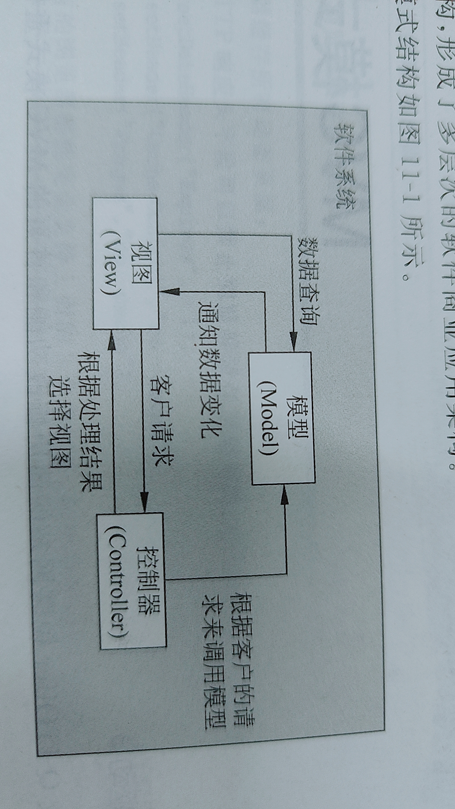
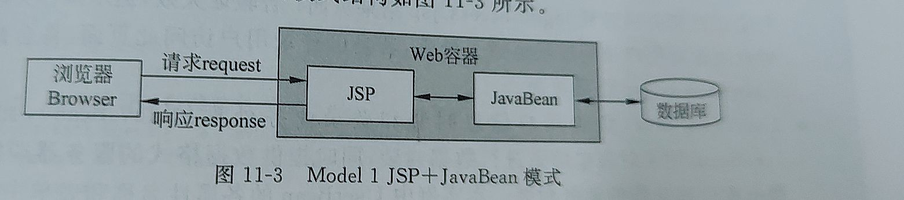
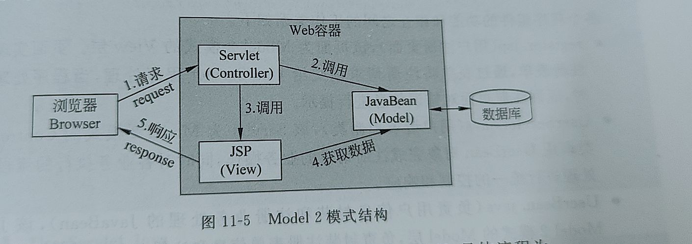

# MVC模式

MVC模式是一种体系结构,有3个部分组成:

* Model(模型)
* view(视图)
* Controller(控制器)

MVC的3个组成部分代表了软件结构的3个层级

1. 模型层

是应用系统的核心层,负责封装数据和业务操作.可分为数据模型和业务模型.

数据模型用来对用户请求的数据和数据库查询的数据进行封装

业务模型用来对业务处理逻辑进行封装

2. 视图层

主要指与用户交互的界面,即应用程序的外观.这层主要被当作用户的操作接口,让用户输入数据和显示数据处理后的结果

3. 视图层

控制层的主要工作就是控制整个系统处理的流程,其角色通常是介于视图层和模型层之间,进行数据传递和流程转向

MVC的主要精神之一就是Model和View分离,使开发者独立开发,互不影响

## Model 1 模式

Model1 有两种使用模式,一种是JSP开发,一种是JSP+JavaBean的设计

完全使用JSP开发的模式结构

优点:

* 开发时间短
* 小幅度修改容易
* 程序可读性降低
* 重复利用率较低

使用JSP + JavaBean的设计

优点:

* 程序可读性高
* 重复可利用率提高

共通的缺点:

* 缺乏流程控制

## Model 2 模式

即基于MVC结构的设计模式

通过JavaBean.EJB等组件实现MVC模型层

通过JSP实现MVC视图层

通过Servlet实现MVC的控制层

优点:

* 开发流程明确
* 核心的程序管控
* 维护容易

缺点:

* 学习时间长
* 开发时间长

