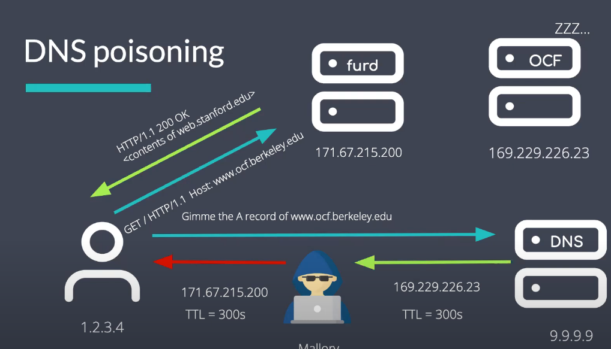
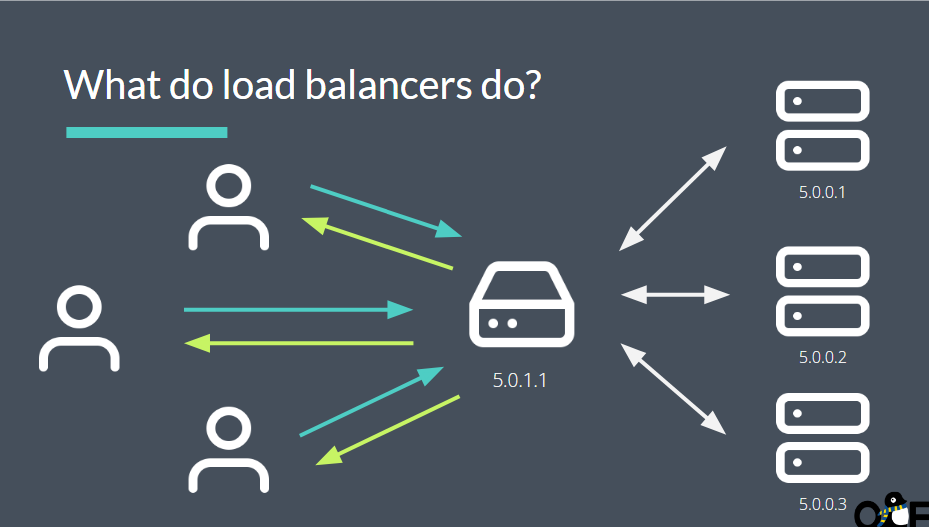

# Web Service

## DNS

什么是DNS:DNS是域名解析系统

当你输入url时,你无法直接连接到服务器,在此之前,那你需要将你的url翻译成IP地址以访问服务器,DNS将完成这个工作.

DNS中的TTL:类似路由表,也就是IP地址的存活时间,当超过这个时间,你就需要去重新请求获取DNS

然而,如果你直接访问ip地址,会得到错误信息

原因:当你访问一个地址时,它会检测你的主机报头

**当使用http/IP时**,你会得到正确的响应

**DNS服务器显然不可能直到所有的ip地址**此时,就需要重定向,也就是说,有一个副DNS服务器来响应你的请求

* 安全

如果你想要安全的访问某网站,请使用你的签名和证书,如果你得到了服务器的许可,就会建立一个安全的链接

DNS污染:劫持你的DNS

解决方案:使用`https`,但不能排除DNS本身被劫持了

## web servers

网络服务器为用户提供了最基本的服务(图像等等)

## load balancers

负载均衡干了什么?

它将原本一个端口一个服务的模式改为多个端口服务同一种请求,也就是所谓的负载均衡

负载均衡仅仅是传递图像而非查找等需要大量性能的操作,故负载均衡器不会过载

**这下可以进行更多的响应了**

缺点:如果负载均衡器出现了故障,那么所有的服务都将出现故障

