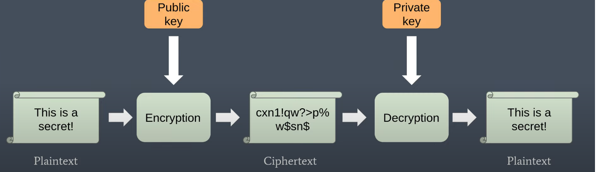
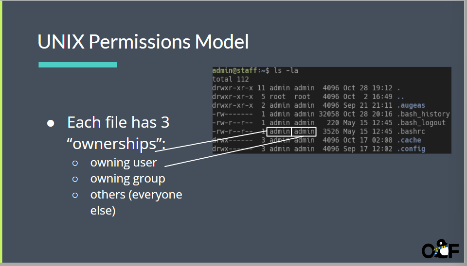
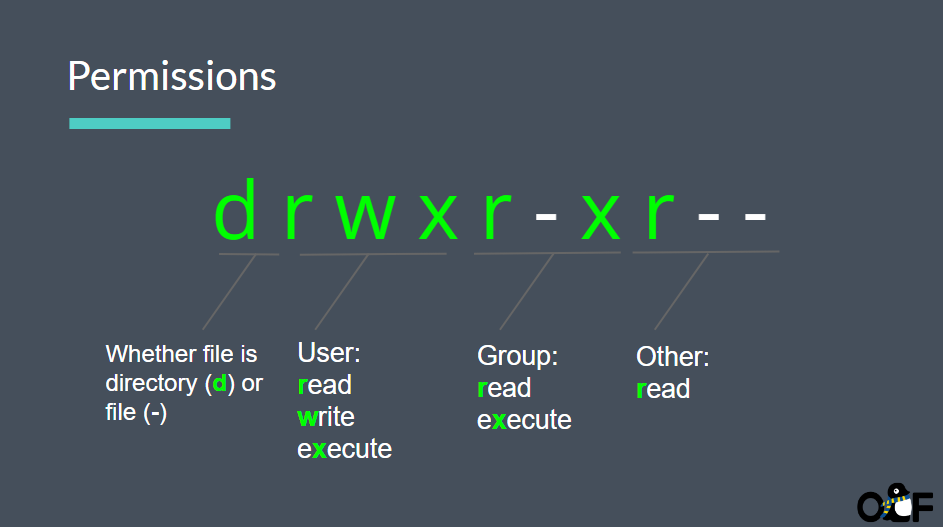

# Security Fundamentals


信息安全体会在很多地方

* 政府信息安全
* 金融信息安全
* 医疗信息安全


# 基本安全原则

* 权限管理
* 深度防御
* 密码
* 身份双重验证


# 目标:确保信息安全

* 确保阅读信息的人有许可
* 保证信息不会被篡改
* 验证信息作者


# 加密信息

使用密匙加密信息,在使用密匙解密信息


通常服务器会发布一个公匙,提供给外部 加密信息

随后,服务器通过私匙解密信息

即非对称加密




哈希算法(md5)

哈希函数将任意长度的数据进行加密(唯一性)

Hash-based MAC（Message Authentication Code）时，通常是指一种用于验证消息完整性和认证消息发送者的密码学技术。MAC是一种保证消息未被篡改的方法，它基于共享的密钥，使用哈希函数生成一个固定长度的认证标签（MAC），然后将该标签附加到消息中。


1. **准备密钥**：双方（通常是消息发送者和接收者）在通信之前需要共享一个密钥。这个密钥必须保密，因为它用于生成和验证MAC。
2. **生成MAC**：发送者使用共享密钥和消息作为输入，通过一个哈希函数生成MAC。这个哈希函数通常是HMAC（Hash-based Message Authentication Code）或类似的算法。生成的MAC是一个固定长度的二进制字符串。
3. **附加MAC**：发送者将生成的MAC附加到消息中，然后将消息发送给接收者。
4. **验证MAC**：接收者在接收消息后，使用相同的共享密钥和相同的哈希函数，计算消息的MAC。然后，接收者将计算出的MAC与消息中附加的MAC进行比较。
5. **验证结果**：如果接收者计算出的MAC与消息中的MAC匹配，那么消息被认为是完整的且未被篡改的。如果MAC不匹配，消息可能已经被篡改，或者密钥不匹配，因此消息被拒绝。

Hash-based MAC的关键优势是它不仅可以用于验证消息的完整性，还可以验证消息的发送者，因为只有知道密钥的合法发送者才能生成正确的MAC。这使得Hash-based MAC在数据传输和通信安全中非常有用，确保消息未被篡改或伪装。

(基于ChatGPT的加密算法解释)


# 身份验证

因为你将公匙发布到网上,几乎所有人都可以通过公匙来给你发送加密信息,所以你还需要确认他们的身份

* 身份签名的主要目的是验证一个主体的身份。这可以通过数字签名技术来实现，其中一个实体使用其私钥对特定数据进行签名，然后接收方使用公钥来验证签名的有效性。这确保了数据的发送者是具有相应私钥的合法主体。


## 过程

1. 签名者生成 公匙 和 私匙
2. 使用私匙对文档做哈希操作
3. 传输
4. 接收者使用公匙解密原始文档的哈希值
5. 验证结果


# 可行性

* 服务器加密解密验证本身需要算力的支持,此时需要考虑可行性


> 如果大量的请求服务器会怎样?


# 文件安全权限

>通常来说,我们需要限制文件的访问权限

```shell
sudo chmod 777 <filename>
//给予文件所有权
```

下面几张图将非常详细的介绍文件权限信息







如果我想给文件夹赋予某权限,并启用继承,我该怎么做?


```shell
sudo chmod +x +r +w <filename>

//可以下载软件启用继承
sudo apt-get install acl  # 对于Debian/Ubuntu

setfacl -m d:u::rwx,d:g::rwx,d:o::r-x /path/to/your/directory


```


# 零信任

零信任（Zero Trust）是一种现代的网络和信息安全模型，它基于以下核心思想：在网络中，不应信任任何用户、设备、或应用程序，即使它们位于内部网络。相反，零信任模型假定网络中的所有实体都可能是不安全的，因此需要不断进行验证和授权。

以下是零信任的一些关键原则和特点：

1. **最小权限原则**：零信任模型采用最小权限原则，即用户和设备只能获得其所需的最低权限级别，而不是广泛的访问权限。这有助于限制潜在的滥用和风险。
2. **多因素身份验证（MFA）**：零信任要求多因素身份验证成为标准，以确保用户的真实身份。通常，这包括使用密码、生物特征、智能卡、手机令牌等多个身份验证因素。
3. **网络分割**：零信任模型推崇网络的分割，以阻止恶意行为者在内部网络中自由移动。这通过网络微隔离、虚拟专用网络（VPN）和容器隔离等技术来实现。
4. **实时威胁检测**：零信任模型侧重于实时威胁检测和响应。它使用机器学习、行为分析、日志分析和威胁情报，以便迅速检测并应对威胁。
5. **适应性访问控制**：零信任采用适应性访问控制，根据用户、设备、位置、时间等因素，决定是否授予访问权限。这种策略更加灵活，根据具体上下文来决定权限。
6. **加密和安全通信**：零信任模型强调数据的加密和安全通信。通信需要进行加密，以保护数据在传输过程中不被窃取或篡改。
7. **审计和日志记录**：零信任要求全面的审计和日志记录，以便监控和审查所有访问和活动。这有助于快速检测潜在的问题。