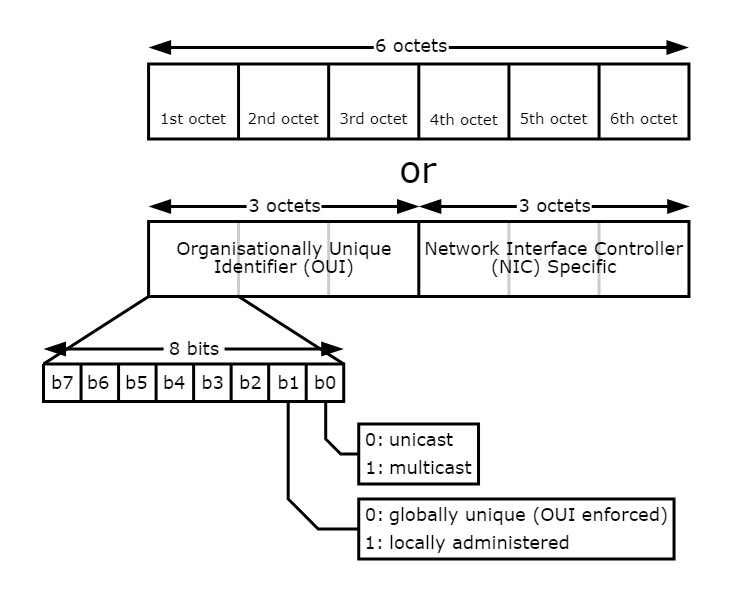

# Introduction to Networking

本章将类比网页浏览来介绍最基础的网络架构(即只讲知识点)


# MAC

* MAC是全球唯一的
* 常以16进制表示



# IP

两种IP地址

1. IPv4
2. IPv6


某些地址(本地地址)被用作环回地址,如果某个服务在主机上,我们只需要访问环回地址就可以访问这个服务(网页)

那么,为什么要以`127.0.0.1`为地址呢?

**仅仅是个习惯罢了**


剩下的就是一些最基础的网络常识了


# ARP

让IP地址和MAC地址一一对应,即学习路由

"单播"和"广播",泛洪

摘抄了一段例子,大概是将网络中子网掩码和路由选择的一部分规则

Take this routing table for example.

```
default via 10.0.2.2 dev eth0
10.0.2.0/24 dev eth0  proto kernel  scope link  src 10.0.2.15
10.0.2.128/25 dev eth0  proto kernel  scope link  src 10.0.2.15
192.168.162.0/24 dev eth1  proto kernel  scope link  src 192.168.162.162
```

A packet destined for `8.8.8.8` would be forwarded out eth0, the default gateway. A packet destined for `10.0.2.1` would be forwarded according to the second entry, out of eth0. A packet destined for `10.0.2.254` would be forwarded according to the third entry, out of eth0. A packet destined for `192.168.162.254` would be forwarded according to the fourth entry, out of eth1.

# DNS

域名解析


# TCP和UDP

计算机网络都有


# Ports(端口)

* 端口编号0~65535
* 常用端口0~1023


# 系统命令


1. `hostname`

简要的写明host名,ip地址等等

与`host`区分,`host`会提供更多的信息

2. `ping`

**尝试ping一下网站吧

3. traceroute

查看你的包经过了哪些地方

4. arp

查看你的路由表

5. dig

查看你的DNS配置

`/etc/resolv.conf` 中有默认配置

6. ip

查看你的IP配置

7. curl

查看url:

URL通常由多个部分组成，用于描述资源的位置和访问方式,包括

* 协议
* 主机
* 端口
* 路径

8. wget

适用下载,和curl类似

9. netstat

查看网络连接等等

10. tcpdump

是一个用于网络数据包分析的命令行工具。它允许用户捕获、显示和分析网络上的数据包流量，以便进行网络故障排除、安全分析和性能优化等操作

11. nc

可以建立TCP连接和UDP连接


# 实验

## project1

使用ping命令和if语句测试网络是否可达

```shell
先回顾下if语句
if [ conditions ] ; then
else
fi
```

注意,if语句中的判断最好单独放出来,shell似乎和高级语言不一样,不太方便


首先,找到ping的返回值

如果成功 返回值0(判断语句条件)

接下来,让它闭嘴:使用-q

只请求一次 -n 1

我的代码

```shell
#!/bin/bash

host(){
	ping  -q -c 1 "www.baidu.com"
	if [ $? -eq 0 ] ; then
		echo "ok"
	else
		echo "Host is not reachable"
	fi
}

host

```


## project2

使用ip查找ipv4的mac地址

首先,查找代码为ip -4 link ens33

使用管道通信十分方便

查找中间一行,即前两行,在最后一行

head -n 2 | tail -n 1

使用sed剔除空格

最后使用cut ' '按照空格分割,取第二部分

给出代码

```shell
#!/bin/bash

new(){
	ip -4 link show ens33 |head -n 2 |tail -n 1 |sed 's/^[[:space:]]*//'|cut -d' ' -f2
}

new

```

 

* head表示从开头计
* tail表示从末尾计


##总结

不是很难,就是使用几行命令进行条件筛选罢了

主要是教你看文档


