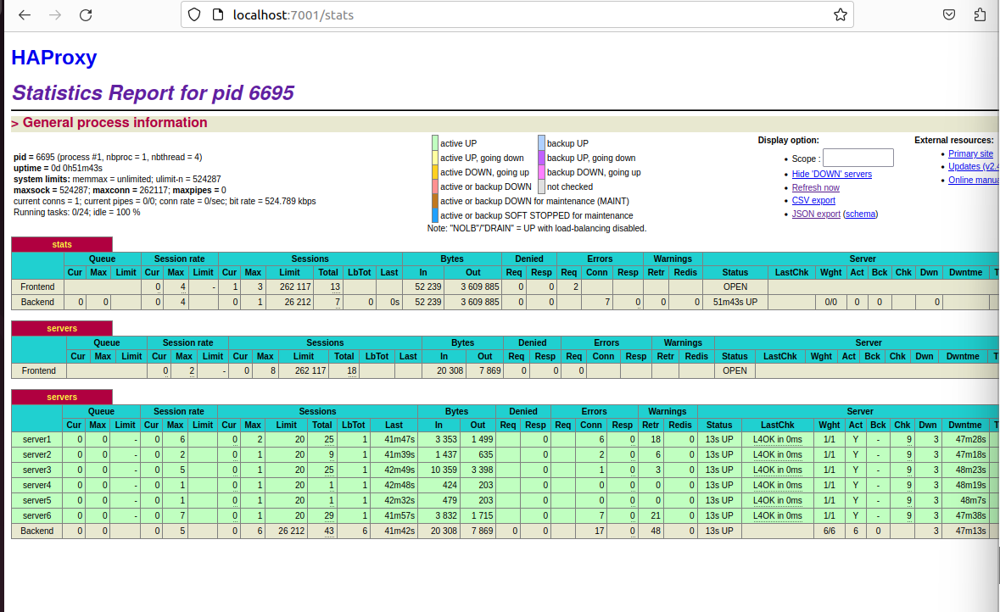

# Web Servers

本lab主要是为了研究web service

前置:下载netstat(net-tools)

```shell
systemctl --type=<service name>
//查看service
systemctl stauts <service name>
//查看具体服务的状态

```


___

# DNS

下载bind9(域名解析服务器)并关闭dnsmasq

```shell
sudo apt purge dnsmasq  //卸载
systemctl stop bind9	//关闭bind9

systemctl cat bind9  	//查看服务内容
```

我们会发现一些熟悉的部分,这部分我们再Lab4见过


当你尝试使用两个不同又相似的命令

* `dig ocf.berkeley.edu @localhost`
* `dig ocf.berkeley.edu`


会得到截然不同的结果

为什么?Gpt的解释

1. `dig ocf.berkeley.edu @localhost`：这个命令将 `dig` 命令、要查询的主机名 `ocf.berkeley.edu` 和 DNS 服务器 `localhost` 分开。这意味着 `dig` 将查询 `ocf.berkeley.edu` 这个主机名，但它会将查询发送到本地的 DNS 服务器 `localhost` 来获取该主机名的 IP 地址。这是标准的 `dig` 查询方式，将查询发送到指定的 DNS 服务器以获取域名解析信息。
2. `dig ocf.berkeley.edu` 是一个用于进行 DNS（域名系统）查询的命令。它用来查找有关域名或主机名的信息，特别是用于查询域名 "ocf.berkeley.edu" 的 DNS 信息。


____

现在,我们正式开始DNS本地服务器的配置

##设置本地DNS的配置

```shell
vim /etc/bind/named.conf.local 
//打开本地配置
加入以下内容
zone "example.com" {
  type master;
  file "/etc/bind/db.example.com";
};
```

详细描述一下这个操作

1. 打开本地配置时,内容为空,原因是默认是没有本地配置的,要你自己去配置
2. 加入的内容大概意思就是:加入eample.com的域名以及解析的文件: **/etc/bind/db.example.com**
3. `type master;`：这一行指定了这个DNS区域的类型。在这里，它被设置为"master"，表示这个DNS服务器是该区域的主要控制者，即它负责维护和管理该区域的DNS记录。

## 配置db.example.com文件


配置文件最好的方式是先**找个模板**

```shell
;
; BIND data file example.com
;
$TTL	604800
@	IN	SOA	ns.example.com. root.example.com. (
				1		      
				; Serial
				604800		
				; Refresh
				86400		  
				; Retry
				2419200		
				; Expire
				604800 )	
				; Negative Cache TTL
;
        IN	NS	ns.example.com.

ns  IN  A   127.0.0.1                
; IP for name server (random ip)
@	IN	A	1.2.3.4                  
; A record for example.com (random ip)
; Add more records (Ex. CNAME, AAAA, MX, subdomains...)
```

* `;`表示注释
* `$TTL`表示DNS记录的生存时间
* `@`：这是一个特殊符号，表示当前域名，也就是"example.com"。
* `IN`：表示Internet类型的记录。
* `SOA`：SOA（Start of Authority）记录定义了区域的权威性和基本参数，包括域名服务器（ns.example.com）和相关的配置信息。
  - `ns.example.com.`：这是主名服务器的名称。
  - `root.example.com.`：这是管理者的电子邮件地址，应该替换为实际的电子邮件地址。
  - `1`：这是序列号，通常用于跟踪区域文件的更改。当您更新DNS记录时，应递增该值。
  - `604800`：刷新时间，表示其他DNS服务器多久需要重新获取区域文件的副本。
  - `86400`：重试时间，表示其他DNS服务器多久需要等待在刷新时间后进行重试。
  - `2419200`：过期时间，表示其他DNS服务器多久后不再信任此区域文件。
  - `604800`：负缓存TTL，表示其他DNS服务器对无效记录的缓存时间。
* `IN NS ns.example.com.`：这是一个Name Server（NS）记录，指定了名为"ns.example.com"的域名服务器。
* `ns IN A 127.0.0.1`：这是一个A记录，将"ns"映射到IP地址"127.0.0.1"，通常用于指定域名服务器的IP地址。
* `@ IN A 1.2.3.4`：这是另一个A记录，将"example.com"映射到IP地址"1.2.3.4"，这通常是您的网站的主机IP地址。


在末尾配置:

```shell
test IN A 93.184.216.34
```

重启服务

```shell
systemctl reload bind9	//使配置生效
```

这时候,我们用本地DNS查看一下example.com以及test.example.com

```shell
dig @localhost example.com
//显示1.2.3.4
dig @localhost test.example.com
//显示93.184.216.34
```


Q1:什么命令可以查看bind9

`systemctl status bind9`

Q2:为什么加了@localhost就会报错

因为本地DNS没有进行配置


# Load Balacing(负载均衡)

前言:本实验将用HAProxy来做负载均衡

* 对GNGINX来说,它最开始就是用来做负载均衡服务器的,但是HAPorxy同样也可以完成目的

____

准备工作:

```shell
sudo apt install haproxy //下载haproxy
下载需要的web文件 	//wget
下载python的服务器框架
sudo apt install python3-tronado
```


* 当我们运行`python3 service.py`时,将建立6个不同的web窗口,为了区分,我们让它显示不同的内容(仅仅是为了实验目的)
* 浏览器`localhost:8080~8085`访问这些网页

使用负载均衡器的目的是:如果我有大量的请求,那么就将这些请求平均分配以保证他们不会oveload


**我们可以通过配置`/etc/haproxy/haproxy.cfg`来配置我们的负载均衡器**


lab给我们提供了一个监听器,使用7001端口

```shell
listen stats
  bind    0.0.0.0:7001
  mode    http
  stats   enable
  stats   hide-version
  stats   uri /stats
```

下面我将解释这些代码的意思

* bind:表示使用缺省地址,目标端口为7001
* mode:建立的是http链接
* stats:这行启用了对服务的统计信息收集。这意味着服务将收集和提供各种统计数据和指标，如请求计数、响应时间等
* uri/stats:请访问`localhost:7001/stats`

## Part1

**我需要做的**:

1. 编辑前端(forntend)
2. 编辑后端(backend)
3. 设置7000端口为监听端口,它将返回负载均衡器分配的端口返回的内容


**我的代码**:

```shell
#frontend
frontend servers
	bind 0.0.0.0:7000
	default_backend servers
#backend
backend servers
	balance roundrobin
    cookie serverused insert indirect nocache
	default-server check maxconn 20
	server server1 0.0.0.0:8080 cookie server1
	server server2 0.0.0.0:8081 cookie server2
	server server3 0.0.0.0:8082 cookie server3
	server server4 0.0.0.0:8083 cookie server4
	server server5 0.0.0.0:8084 cookie server5
	server server6 0.0.0.0:8085 cookie server6
```

_____

**前端部分**

____

* bind 0.0.0.0:7000 :使用7000端口,本地ip
* default_backend servers :使用名为server作为后端

____

**后端部分**

_____

* balance roundrobin:使用 roundrobin策略
*  cookie serverused insert indirect nocache:表示使用cookie,并不做多研究
* default-server check maxconn 20:设置后面设置的服务器默认都进行服务器检查,最大访问数量为20
* server server1 0.0.0.0:8080 cookie server1:以此为例,设置server1**代理**0.0.0.0:8080,使用cookie

下面是展示:

7001/stats #



可见,使用了check后,我设置的服务器代理,都能正常运作,显示为绿色

当我的服务器端口关闭时,会显示红色


7000 #

展示最近有流过信息的端口的内容

## Part2

使用`http://localhost:7000/crash`来关闭某个服务器端口,它将按顺序关闭端口


当然也可以使用`curl localhost:<port>/crash`来关闭指定端口


Q1:当你刷新7001时,有什么发现?

A:端口逐渐变红,即关闭了端口


Q2:你使用了什么负载均衡算法?

A:roundrobin


Q3:你加入了什么配置代码?

A:如上所示


Q4:当你加入check时,你发现有什么变化?

A:将显示服务器状态,绿色为正常运行,红色为关闭或故障


Q5:当你crash一个工作时,7001发生了什么变化?

A:端口逐个变红


Q6:如果你关闭了所有的端口,http将返回什么信息?

A:error:503,同时我的service终止了


# 总结

haproxy仅仅是一个所谓的代理,而非必要的工具

即你不需要设置你的服务器代码,将代码放到这个工具上运行


它所做的仅仅只是**代理端口**进行负载均衡


在我的实验过程中,我发现了它的负载均衡算法:

* 它似乎在少量请求时,会将所有的流量流过同一个端口,只使用一个端口来响应
* 只有在流量很多的时候,才会使用其他端口相应
* 因为7000端口始终返回同一个端口的内容,且每次启动返回内容都不同(应该是随即使用一个空闲端口)


我遇到了一些问题:

* 当我下载文件时,使用wget下载,但是我尝试了很多次发现下载内容有误,发现github上代码下载有他特定的方式.纠正错误后仍然未响应,原因是我没有进行`apt update`
* 查阅文档时,发现很多东西我并不需要,其实可以跳过
* 文档写的很全,基本上我代码没有太大问题,可喜可贺
* 如果一个服务无法启动,在linux中我可以使用`systemctl status <servcie name>`来查看服务的状态以及报错原因,非常方便
