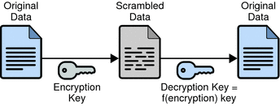

# use GnuPG

GnuPG是一个开源的加密和数字签名工具,用于确保数据的安全性和完整性





```shell
sudo apt install gnupg  //使用源下载文件
```

如果使用`git`克隆文件,我该怎么安装?

首先,文件中一定有说明书,来引导你安装

你需要安装一些额外的依赖来支持你的软件运行


## 使用对称加密

```shell
gpg --symmetric <filename>
//加密
gpg --decrypt <filename.gpg>
//解密

```


# 设置自己的私匙-公匙对


GnuPG可以储存自己的公匙-私匙对,当然也可以生成

```shell
gpg --full-generate-key
//创造一个公匙-私匙对
gpg --recipient [RECIPIENT] --encrypt [FILE]
//使用用户名为[RECIPIENT]的公匙 加密 file
gpg --decrypt [FILE].gpg
//使用私匙解密

gpg --sign [FILE]
//使用私匙签名
gpg --verify [FILE].gpg
//验证签名是否可以被你的公匙解密
```


# 哈希算法(验证文件完整性)

使用

1. `sha1sum [FILE]` to get the SHA1 hash of `[FILE]`.
2. `md5sum [FILE]` to get the MD5 hash of `[FILE]`.


会得到一串哈希值或md5,因为hash和md5已经被破解不能用于加密,所以现在常用来检验文件的完整性

# 文件权限

课上已经讲的很详细了

