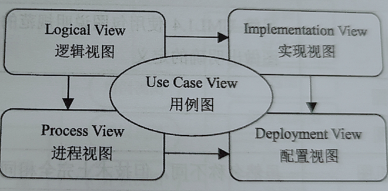
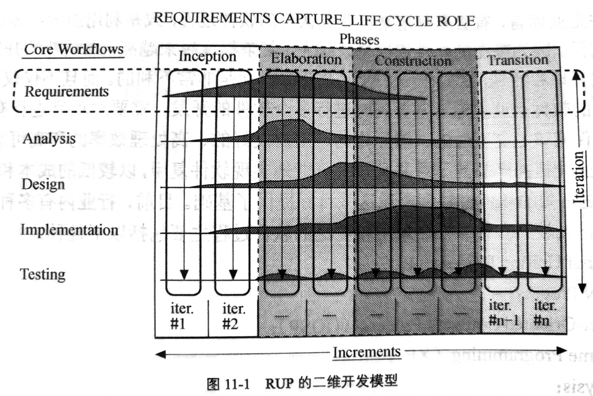

# 软件工程与Rose建模

## 软件工程的生命周期

1. 需求捕获阶段

需求捕获是整个开发过程的基础

2. 系统分析与设计阶段

3. 系统实现阶段

也就是编码阶段

4. 测试阶段
5. 维护阶段

软件工程的三大目的:软件的可维护性,软件的可复用性,软件开发的自动化

# UML概述

UML是一种统一建模语言,它的主要作用是帮助用户对软件系统进行面向对象的描述和建模

组成:视图,图,模型元素和通用机制

UML是用来描述模型的,通过模型来描述系统的结构或静态特征,以及行为或动态特征

## "RUP 4+1"视图

1. 逻辑视图:用来揭示系统功能的内部设计和协作情况,体现了系统的功能需求
2. 实现视图:描述了代码的组织方式,静态结构,体现了系统的可拓展可移植可重用性
3. 进程视图:显示系统的并发性,解决同步问题,体现了系统的稳定性,鲁棒性,安全性
4. 配置视图:描述了软件到硬件的映射,反映了分布式特性,体现了系统的安装部署要求
5. 用例视图:描述了系统应具备的功能,是其他视图的核心,直接驱动其他视图的开发

## UML中的事物

* 结构事物:包括类,接口,用例,协作,活动类,组件和节点
* 行为事物:是UML模型中的动态部分,代表时间和空间上的动作,主要有两种:交互和状态机

状态机是对象的一个或多个状态的集合

* 组织事物::是UML模型中组织的部分,只有一种,称为"包"

包是一种有组织地将一系列元素分组的机制

* 辅助事物:属于这一类的只有注释

##UML中的关系

* 关联关系

指一种对象和另一种对象有联系

* 聚合关系

表示类与类之间的关系是整体与部分的关系

* 依赖关系

描述两个模型,一个模型是独立的,另一个模型不是独立的,它依赖于独立的模型元素

* 泛化关系

与java中的继承有些类似

* 实现关系

将一种元素和另一种元素连接起来,接口只是行为的说明,而不是结构或者实现.真正的实现由前一个模型元素完成

* 组合关系

是关联关系的一种特例,比聚合更强,同时体现整体与部分间的关系,但此时整体与部分是不可分的,整体生命周期的结束也意味着部分生命周期的结束,比如你和你的大脑

## UML中的图

用例图,类图,对象图,组件图,配置图,时序图,协作图,状态图,活动图

# 用例视图(大题)

## 概念

用例是对一个系统或一个应用的一种单一的使用方式所作的描述

用例是一个叙述性的文档,用来描述参与者使用系统完成某个事件时的事情发生顺序

## 参与者,用例间的关系

* 关联关系
* 泛化关系:一个用例可以被特别列举为一个或多个子用例
* 包含关系:一个用例的行为包含了另一个用例的行为.基础用例可以看到包含用例,并依赖于包含用例的执行结果,但时二者不能访问对方的属性
* 拓展关系:一个用例可以被定义为基础用例的增量拓展

# 静态图

## 类图

类图是描述类,接口,协作以及它们之间关系的图,用来显示系统中各个类的静态结构.一个类图根据系统中的类以及各个类之间的关系描述系统的静态图.

包含7个元素:类,接口,协作,依赖关系,泛化关系,实现关系和关联关系

类图是静态图的一部分,主要用来描述软件系统的静态结构.

## 类图中的元素------类

类是UML的模型元素之一

类用矩形表示,并且被矩形划分为三个部分:名称部分,属性部分,操作部分

顶部存放名称,中间存放属性,类型,初始值,底部存放操作,参数表,返回值

对不同的类的属性,由不同的符号,具体参见csdn

## 接口

接口是在没有给出对象的实现和状态的情况下对对象行为的描述.接口包含操作但不包含属性,且它没有对外界可见的关联

一个类可以实现多个接口,且所有的都可以实现接口中的操作

* 当一个接口在某个特定的类中实现时,使用该接口的类通过一个依赖关系与该接口相连
* 如果依赖于某个接口类,则指向该接口类

##类图元素----关系P82

1. **依赖关系**:依赖表示两个或多个模型元素之间语义上的关系.它只将模型元素本身连接起来而不需要用一组实例来表达他的意思

   泛化,关联,实现都是依赖关系,但是他们有更特别的语义

   UML定义了4种基本依赖类型:使用依赖,抽象依赖,授权依赖,绑定依赖

   * 使用依赖:使用依赖是非常直接的,表示客户使用提供者提供的服务来实现它的行为(使用,调用,参数,发送,实例化)

   * 抽象依赖:表示客户与提供者之间的关系,依赖于在不同抽象层次上的事物(跟踪,精华,派生)

   * 授权依赖:表示一个事物访问另一个事物的能力(访问,导入,友元)

   * 绑定依赖:将数值分配给模板的参数(绑定)

2. **泛化关系**:是一种存在于一般元素和特殊元素之间的分类关系

   *  在泛化关系中,使用了一条从子类指向父类的空心三角箭头表示

3. 关联关系:是一组具有共同特征,行为特征,关系和语义的链接,它是一种结构关系
4. 实现关系:实现是规格说明和其实现之间的关系,它将一种模型元素与另一种模型元素连接起来,比如类和接口

##对象图

表示在某一时刻一组对象以及它们之间关系的图.可以被看作是类图在某一时刻的实例.

可以包含标注和约束

## 包图

打包语义相近且倾向于一起变化的元素组织(类,接口,组件,节点和图)

* 包名,扩展形式,路径名(图片)

包拥有的元素

一个模型的包的各个同类建模元素不能拥有相同的名字

不同模型包的各个建模元素可以能具有相同的名字

包的可见性

公有的:+

受保护的:#

私有的:-

引入与输出

引入:允许一个包中的元素单向访问另一包中的元素 

输出:如图

包中的泛化关系

在包之间可以有两种关系

* 引入和访问依赖
* 泛化 : 用于说明包的家族

包之间的泛化关系类似类之间的泛化关系

# 交互图

## 时序图----一组对象

时序图 描述了对象之间传递消息的时间顺序,它用来表示用例中的行为顺序,是强调消息时间顺序的交互图

时序图包含了4个元素:对象,生命线,激活,消息

当一个对象向另一个对象发送消息时,此消息开始于发送对象底部的虚线,终止于接收对象底部的虚线.

几种常用的消息符号:

对象的创建和撤销:

# 状态图和活动图(各一大题)

## 状态图

状态机

状态机是展示状态与状态转换的图,状态机包含了一个类的对象在其生命周期所有状态的序列以及对象对接收到的事件所产生的反应

状态机由5部分组成: 状态,转换,事件,活动和动作

* 状态:表示一个模型在其生存期内的状况,如满足某些条件,执行某些操作或等待事件
* 转换:表示两个不同状态之间的联系
* 事件:是在某个时间产生的,可以触发状态转换的部分
* 活动:是在状态机中进行的一个非原子的执行
* 动作:是一个可执行的原子计算

状态图

一个状态图表示一个状态机,主要用于表现从一个状态到另一个状态的控制流.

一个简单的状态图示意图:

1. 状态

状态是状态机的重要组成部分,图形上,使用一个圆角矩形表示一个状态

一个状态有5个组成部分:

名字:由一个字符串构成

入口/出口动作:可以是原子动作,也可以是动作序列

内部转换:不会引起状态变化的转换,此转换的触发不会导致状态的入口/出口动作被执行

延迟事件:该状态下暂不处理,但推迟到该对象的另一个状态下事件处理队列

子状态:状态的嵌套结构,包括顺序子状态和并发子状态

2. 转换

转换由5个部分组成:源状态,目标状态,触发事件,监护条件和动作

源状态:转换描述的是状态机所在的对象的状态的变化.转换使对象从某个状态转换到另一个状态.

目标状态:转换使对象从一个状态到另一个状态,转换完成后,对象状态发生了变化,这时对象所处的状态就是转换的目标状态.目标是转换完成后活动的状态.在图像上,转换的源状态位于表示转换箭头的起始位置,目标状态就是箭头所指的状态

触发事件:描述了对象具有事件驱动的动态行为

监护条件:转换可能具有一个监护条件,即满足条件再转换

动作:当转变被激活时,它对应的动作被执行

状态图的用途:用于对系统的动态方面建模,动态方面指出现在系统体系结构中任一对象按事件排序的行为

## 活动图

活动图是某一事情正在进行的状态.既可以是现实生活中正在进行的某一项工作,也可以是软件系统中某个类对象的一个操作.在状态机中表现为由一系列动作组成的非原子的执行过程:如图所示

UML中,活动图中的活动用圆角矩阵表示,但更接近椭圆

活动图和流程图的区别:流程图着重描述处理过程,活动图能表示并发活动的情形,而流程图不能,活动图是面向对象的,而流程图是面向过程的

活动图的组成元素:动作状态,活动状态,动作流,分支与合并,分叉与汇合,泳道和对象流

1. 动作状态:对象的动作状态是活动图最小单位的构造块,表示原子动作.动作状态表示状态的入口动作.入口动作是在状态被激活的时候执行的动作.
2. 活动状态:可以被理解成一个组合,它的控制流由其他活动状态或动作状态组成.可以被中断,可以嵌套
3. 动作流:当一个动作状态或活动状态结束时,该状态就会转换到下一个状态,这就是无触发转移
4. 分支与合并:在软件系统的流程图中,分支十分常见,描述了软件对象在不同判断结果下所执行的不同动作,在活动图中,分支与合并由空心小菱形表示.分支包括一个入转换和两个带条件的出转换,如图所示:

5. 分叉和汇合:建模过程中,可能会遇到对象在运行时存在两个或多个并发运行的控制流.可以用分叉把路径分成两个或多个并发流,然后使用结合流,同步这些并发流,如图所示:

6. 泳道:将活动图的活动状态分组,每一组表示负责那些活动的业务组织.从语义上,可以被理解为一个模型包,如图:

7. 对象流:用活动图描述某个对象时,可以把所涉及的对象放置在活动图上,并用一个依赖将这些对象连接到对它们进行创建,撤销的活动转换上.这种依赖关系和对象的应用被称为对象流.使用矩阵表示对象.

# UML组件与配置

## 组件图

组件图是面向对象系统的物理方面建模时使用的两种图之一,另一种图是配置图

组件图描述软件组件以及组件之间的关系,组件本身是代码的物理模块,组件图则显示了代码的结构

组件图包括三种关系:组件,接口和依赖

如图所示:

组件:定义了良好的物理实现单元,包括模型元素,身份标识和接口

* 名称:位于图标内部,定义组件名,也可以包括包名:如图所示

* 类型:有三种类型的组件
  * 配置组件:配置组件是形成可执行文件的基础,如DDL,exe文件
  * 工作产品组件:工作产品组件是配置组件的来源
  * 执行组件:执行组件是最终可运行系统产生的运行结果
* 接口:是一个类给另一个类的一组操作.如果一组类和父类之间没有继承关系,这些类的行为可能包括同样的操作,即接口

* 关系:包括依赖,泛化,关联和实现.
  * 依赖关系使用虚线头表示.
  * 实现关系用实线表示.实现关系多用于组件和接口之间.

## 配置图

配置图是面向对象系统物理方面建模时使用的两种图之一

配置图显示了运行软件系统的物理硬件,以及如何讲软件部署到硬件上. 

配置图可以包括包和子系统,通常包括节点,组件和关联关系

如图所示,是租赁系统的系统配置图:

### 节点

节点是在运行时代表计算机资源的物理元素.使用一个三维立方体表示.

节点和配置的异同:

* 都可以有实例,可以被嵌套,可以参与交互
* 配置是参与系统执行的事物,节点是执行配置的事物
* 配置表示的是逻辑元素的物理包装,节点表示配置的物理配置

1. 名称:位于节点内部
2. 类型:分为处理器和设备两种类型
   1. 处理器:可以执行软件,具体有计算能力的节点
   2. 设备:没有计算能力的节点,一般都是提供某种服务,如打印机,扫描仪都是设备

### 组件

就是组件图中的基本元素,使用带support的虚线箭头表示

### 关系

关联和依赖,依赖使用虚箭头,关联使用实箭头

# Rose双向工程

## 双向工程简介

正向工程是指从模型直接产生一个代码框架

逆向工程是指讲代码转换为模型.如果改变了代码,需要同步改变模型.

## RUP简介(选择题)

RUP可以用二维坐标来描述,横轴通过时间组织,是过程展开的生命周期特征,体现开发过程的动态结构.纵轴以内容来组织,是自然的逻辑活动,体现开发过程的静态结构.

* LIFE CYCLE指软件开发生命周期,由5个部分组成:需求捕获,系统分析,系统设计,系统实现,系统测试
* Core Workflows指软件开发的核心工作流,**包括4个阶段:起始阶段,分析与设计阶段,构建阶段和完成阶段**.
* 纵向的Iteration表示软件开发生命周期的5个部分是相互交错,反复迭代的,而不是一遍可以完成的.横向的Increments表示通过核心工作流的每一个阶段的积累才可以完成软件开发过程.

